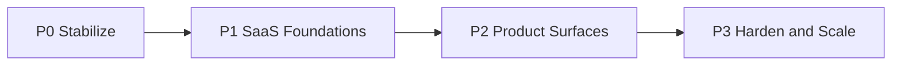

# Implementation Roadmap — PAS 1.0.0 Binding

| Field | Value |
|---|---|
| Status | Active |
| Based on | PAS **1.0.0** (Frozen) |
| Execution owner | [PAS-06](./pas/06-engineering-and-operations.md) |
| Branching | Feature branches per phase (e.g. `feature/p0-stabilize`) → merge to `main` when phase DoD is met |

Follow **PAS-06 ADR-06-004**: P0 → P1 → P2 → P3 with hard Definition of Done (DoD) gates. Do not start the next phase until DoD is met (or risk acceptance is recorded). PAS-01–05 remain the architectural source of truth; this document is the working execution checklist.

---

## Branching and GitHub delivery

| Practice | Detail |
|---|---|
| Phase branch | One long-lived feature branch per phase (current: `feature/p3-harden-and-scale`) |
| Merge to `main` | When that phase’s DoD is fully met |
| Push cadence | Push the phase branch / merge to `main` at major milestones (phase DoD), not necessarily every WIP commit |
| Next phase | After merge, cut a new branch (e.g. `feature/p1-saas-foundations`) from `main` |
| Scope | Keep phase work on its branch; avoid mixing P1+ work into a P0 branch |

---

## How to use this

| Rule | Practice |
|---|---|
| Binding docs | Implement against PAS-02–05; PAS-06 only sequences |
| Phase gate | Meet DoD before advancing |
| Evolve in place | No greenfield rewrite ([ADR-01-001](./pas/01-vision-and-principles.md#adr-01-001-evolve-existing-system-no-greenfield-rewrite)) |
| Readiness first | No FE theater before P0 ([ADR-01-004](./pas/01-vision-and-principles.md#adr-01-004-production-readiness-over-feature-expansion)) |
| Small team | One workstream at a time when possible; parallelize only independent streams |

---

## P0 — Stabilize *(merged)*

**Intent:** Make the existing backend trustworthy for multi-user use. No full frontend yet.

**Branch:** `feature/p0-stabilize` → merged to `main`

### Work packages (suggested order)

| # | Work package | PAS | Concrete outcomes |
|---|---|---|---|
| 1 | **Authz hardening** | 03 | Auth on review; ownership/admin on approve/reject; shared authz deps; remove dead auth helpers |
| 2 | **Alembic baseline** | 03 / 02 | Wire Alembic; baseline revision = full schema; ban production `create_all` |
| 3 | **Pipeline gates** | 04 | Workflow only after field verify + approval; re-check on verify/approve events; replace print stubs with log + notify |
| 4 | **Pipeline correctness** | 04 | Fix resume name extraction; configurable confidence threshold; empty OCR → needs_review/failed; deterministic model path (no CWD) |
| 5 | **Notification events** | 04 | Emit status-accurate catalog: `document.processed` / `needs_review` / `failed` / `approved` / `rejected` / `workflow.started` |
| 6 | **Health** | 06 | `/health` (or equivalent) succeeds only when DB is reachable |
| 7 | **Tests + CI seed** | 06 | Minimal tests: authz matrix cells + gate logic; run in CI |
| 8 | **Docs honesty** | 06 | Backend README matches reality (remove false “production ready”) |

### Authz matrix cells to cover in tests (PAS-03)

Enforce server-side for at least:

- Review: authenticated + ownership (user) or admin
- Approve/reject: **admin only**
- List all / pending approvals: **admin only**
- Field verify/edit: own doc (user) or any (admin)
- Notifications: own (user); any only as admin ops

### P0 Definition of Done

- [x] Review + approval match PAS-03 matrix in automated tests
- [x] Alembic migrates clean DB to full schema; prod start does not depend on `create_all`
- [x] Workflow not invoked on first-pass unverified fields; gate re-check path exists
- [x] Classifier loads without requiring a specific shell CWD
- [x] `/health` succeeds only when DB reachable
- [x] Critical authz + gate tests pass in CI

> Checkboxes above reflect implementation on `feature/p0-stabilize`. Confirm with `pytest -q` in `backend/` before merging to `main`.

**Exit:** Merge `feature/p0-stabilize` → `main`, then cut `feature/p1-saas-foundations`.

---

## P1 — SaaS foundations *(merged)*

**Intent:** Platform shape required by PAS-02/03 before portals.

**Branch:** `feature/p1-saas-foundations` → merged to `main`

| # | Work package | PAS | Concrete outcomes |
|---|---|---|---|
| 1 | **API versioning** | 02 | Mount `/api/v1` routers; shim/deprecate unversioned paths as needed |
| 2 | **Storage adapter** | 02 | Interface + local adapter (dev) + Supabase adapter (staging/prod) |
| 3 | **Job boundary** | 02 / 04 | Enqueue interface; in-process runner still OK |
| 4 | **Session model** | 03 | Access + refresh tokens; rotation; logout/revocation; inactive users blocked |
| 5 | **Admin seed** | 03 | Documented, repeatable seed/ops process (no admin signup API) |
| 6 | **Compose** | 06 | `api` + `db` (+ optional storage emulators); one documented bring-up |
| 7 | **Secrets hygiene** | 06 | Env-based config; commit `.env.example` only |
| 8 | **CI gates** | 06 | Lint + test + build image on PR/main |

### P1 Definition of Done

- [x] Access + refresh auth; rotation works; inactive users blocked
- [x] Binaries via storage adapter (Supabase in staging/prod config)
- [x] Compose brings up API + DB with documented commands
- [x] CI blocks merge on failing tests/lint
- [x] Admin seed documented and repeatable for staging

> Confirm with `pytest -q` and CI green on `feature/p1-saas-foundations` before merging to `main`.

**Exit:** Merge phase branch → `main`, then cut `feature/p2-product-surfaces`.

---

## P2 — Product surfaces *(merged)*

**Intent:** Ship Next.js and close human-facing loops. Depends on P1 `/api/v1` + refresh auth.

**Branch:** `feature/p2-product-surfaces` → merged to `main`

| # | Work package | PAS | Concrete outcomes |
|---|---|---|---|
| 1 | **Greenfield FE** | 05 | Next.js App Router in `frontend/`; do not revive deleted Vite scaffold |
| 2 | **BFF auth** | 05 / 03 | Memory access token; httpOnly refresh cookie via Next Route Handlers |
| 3 | **Data layer** | 05 | Axios + TanStack Query → `/api/v1` |
| 4 | **Auth UX** | 05 | Shared Login; user-only Signup; role routing to user/admin dashboards |
| 5 | **User portal** | 04 / 05 | Upload → status → field review → notifications |
| 6 | **Admin portal** | 03 / 05 | Pending approvals + approve/reject; cross-user review |
| 7 | **Notification APIs ↔ UI** | 03 / 04 / 05 | List + mark-read wired |
| 8 | **Staging** | 06 | FE + API + DB + Storage topology |
| 9 | **Marketing MVP** | 05 | Landing + essential links (thin quality OK) |

### P2 Definition of Done

- [x] Protected actions redirect to Login with return URL
- [x] `user` / `admin` land on correct dashboards; no admin signup
- [x] Staging E2E happy path: register/login → upload → process → review/approve → notification
- [x] Public pages at MVP thin quality

**Exit:** Merge phase branch → `main`, then cut `feature/p3-harden-and-scale`.

---

## P3 — Harden and scale *(current)*

**Intent:** Operability under real use; queue only when [ADR-02-004](./pas/02-system-architecture.md#adr-02-004-evolve-background-processing-via-a-job-boundary) triggers fire.

**Branch:** `feature/p3-harden-and-scale`

| # | Work package | When |
|---|---|---|
| Structured JSON logs + correlation IDs | Always in P3 |
| Error tracking (Sentry-class) staging/prod | Always |
| Rate limit auth; security headers; CORS allowlist | Always |
| Pagination on list APIs | Always |
| Queue-backed worker (same codebase) | Only if load/isolation/retry triggers met → [deferred](./ops/QUEUE_DEFERRAL.md) |
| Backup/restore runbook (Postgres + object storage) | Always; test once on staging → [runbook](./ops/BACKUP_RESTORE.md) |
| Expand tests (FE smoke, more pipeline, migration dry-run in CI) | Always |

### P3 Definition of Done

- [x] Staging + prod: health/readiness (`/live`, `/ready`), structured logs, error tracking (Sentry when `SENTRY_DSN` set)
- [x] Auth rate-limited; CORS locked to known FE origins; security headers
- [x] List endpoints paginated (`items`/`total`/`page`/`page_size`/`pages`)
- [ ] Backup/restore documented and tested on staging *(runbook landed; staging drill remains ops)*
- [x] Queue adopted under ADR-02-004 **or** explicitly deferred with measured rationale → [QUEUE_DEFERRAL.md](./ops/QUEUE_DEFERRAL.md)

---

## Cross-cutting orchestration (do not reorder)

From PAS-06 migration orchestration:

1. **Security & schema (P0)** — PAS-03 authz + Alembic
2. **Platform adapters (P1)** — PAS-02 storage, `/api/v1`, job boundary; PAS-03 refresh
3. **Pipeline correctness (P0–P1)** — PAS-04 gates, model path, notifications
4. **Frontend (P2)** — PAS-05 greenfield + BFF
5. **Harden (P3)** — observability, rate limits, queue triggers

---

## Explicitly out until triggers

| Deferred | Until |
|---|---|
| Kubernetes | Proven Compose mastery + scale need |
| Broker/queue | ADR-02-004 triggers |
| Elasticsearch / advanced search | Post-MVP pain |
| Multi-tenancy / billing | PAS-01 future considerations |
| LLM extraction | New ADR under PAS-04 |
| Full marketing CMS | After P2 DoD |

---

## References

| Doc | Role |
|---|---|
| [docs/pas/README.md](./pas/README.md) | Frozen PAS hierarchy |
| [docs/pas/06-engineering-and-operations.md](./pas/06-engineering-and-operations.md) | Phase DoD, CI/CD, Compose, testing |
| [docs/audit/AUDIT_REPORT.md](./audit/AUDIT_REPORT.md) | Current-state baseline |
| [docs/README.md](./README.md) | Docs index |
