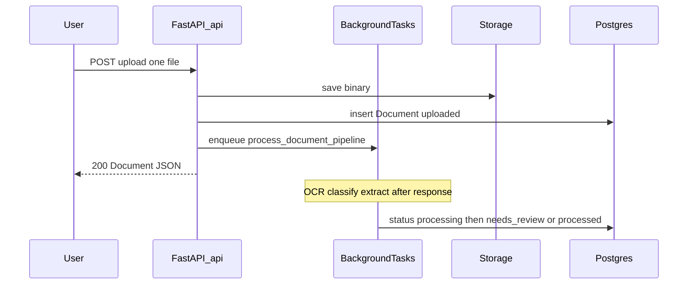

# Upload and concurrency capacity

Assessment of **current** behavior (code + PAS). Not load-test results. Multi-file upload and worker queues are out of scope here; see [QUEUE_DEFERRAL.md](./QUEUE_DEFERRAL.md) for when processing should leave the API process.

## Why only one file per upload

| Layer | Behavior |
|---|---|
| Frontend | `frontend/app/(user)/upload/page.tsx` — `<input type="file">` without `multiple` |
| API | `POST /api/v1/documents/upload` — single `file: UploadFile = File(...)` |
| Domain | One HTTP accept → one `Document` row → one pipeline job |

Multi-file upload is **not implemented**, not blocked by a hidden quota. Users can still process many documents by uploading them one after another; each request returns quickly and enqueues its own job.

PAS-04 mentions validated file type/size at the API edge, but **no max file size / max pages / MIME allowlist is enforced in application code** beyond what Supabase/bucket policies or the host impose.

## How processing stays responsive

- Upload returns after storage + DB insert; OCR/ML run via in-process `BackgroundTasks` (`app/services/jobs.py`).
- The UI stays usable (lists/detail poll while status is `uploaded` / `processing`).
- **Trade-off:** OCR/Poppler/classifier share the **same process and thread pool** as API requests ([ADR-02-004](../pas/02-system-architecture.md), [QUEUE_DEFERRAL.md](./QUEUE_DEFERRAL.md)). Under heavy concurrent OCR, login/list latency can degrade even though uploads still return 200.

There is **no worker service**, **no broker**, **no per-user job cap**, and **no global concurrency semaphore**.

## Practical capacity

| Question | Current answer |
|---|---|
| Files per single upload action | **1** (API + UI contract) |
| Files a user can process over time | Unlimited in code; limited by storage, DB, and pipeline wait time |
| Concurrent multi-user uploads | Many users can hit upload at once; each gets a Document + background job |
| Concurrent pipelines | Soft-limited by **one API process**; jobs pile up in-process; CPU-heavy OCR contends poorly |
| Hard quota (N users × M files) | **None** — MVP assumes low volume / single Compose `api` replica |
| Auth rate limit | Login/register/refresh only (~20/min/IP by default); **not** applied to upload |

**Rule of thumb (not a guarantee):** a handful of concurrent uploads (few users, few docs) is the intended range. Dozens of simultaneous OCR jobs on one small VM will make the API feel slow or unstable. Horizontal scale needs a real worker/queue when ADR-02-004 triggers fire.

## Multi-user concurrency in plain terms

- **Auth / DB / storage:** multiple users can register, login, upload, and list concurrently; Postgres and object storage handle that better than the in-process OCR path.
- **Processing:** all pipeline work competes inside the single `api` service. More concurrent uploads ⇒ more background OCR ⇒ less headroom for interactive API calls.
- **No fairness:** one user flooding uploads can starve others’ processing on the same instance.

## Multi-file upload (future product change)

Would require FE `multiple` and either an API that accepts a list or N sequential client uploads, plus batch status UX. Throughput would still be bounded by the same in-process processing bottleneck until a queue/worker is adopted.
