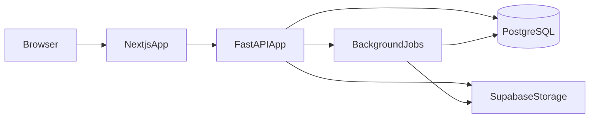
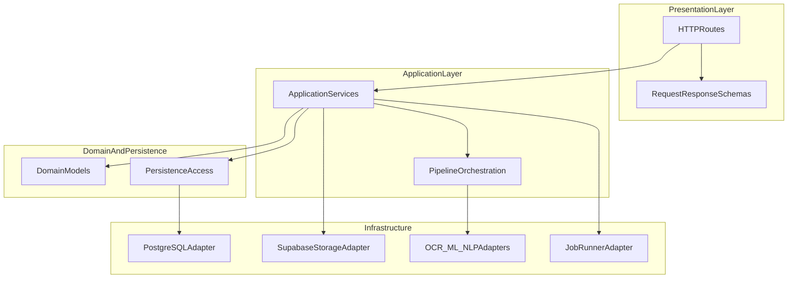
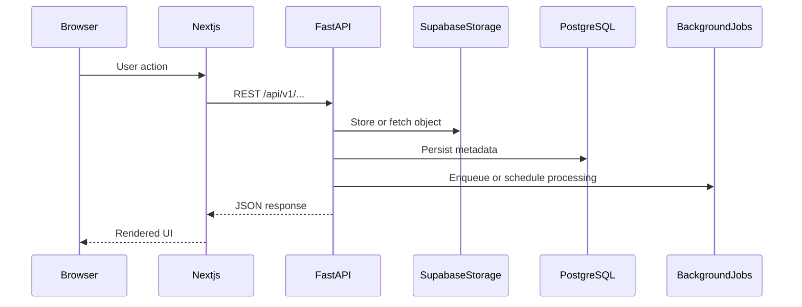

# System Architecture

| Field | Value |
|---|---|
| Doc ID | PAS-02 |
| Status | Frozen |
| Version | 1.0.0 |
| Last Updated | 2026-08-02 |
| Owners | Architecture / Backend |

## Purpose

Define the target modular-monolith system topology for Smart Document Workflow AI: major components, module boundaries, layered backend structure, storage strategy, background processing evolution, API versioning philosophy, and external integration boundaries. This document is the architectural foundation for PAS-03 through PAS-06.

## Audience

Backend and frontend engineers, and architects implementing or reviewing structural changes.

## Scope

| In scope | Detail |
|---|---|
| System topology | Browser, Next.js, FastAPI, PostgreSQL, Supabase Storage, in-process AI capabilities, background jobs |
| Module boundaries | Logical modules and their responsibilities |
| Backend layering | Presentation → application/services → domain/persistence → infrastructure |
| Frontend ↔ backend integration | Architectural interaction pattern (not UI routes) |
| Storage architecture | Document binaries vs metadata |
| Background processing strategy | When in-process tasks suffice; when a queue is justified |
| API architecture | REST philosophy, versioning, grouping, error consistency |
| External boundaries | What is inside the monolith vs external services |
| Architecture diagrams | High-level Mermaid views |

Product vision and principles remain owned by [01-vision-and-principles.md](./01-vision-and-principles.md) ([ADR-01-002](./01-vision-and-principles.md#adr-01-002-modular-monolith-architecture)).

### High-level architecture overview

The target system is a **Modular Monolith**:

- One **Next.js** application delivers public and authenticated product surfaces.
- One **FastAPI** application exposes a versioned REST API and hosts business modules, AI orchestration, and job entry points.
- **PostgreSQL** is the system of record for metadata and domain state.
- **Supabase Storage** holds document binary objects.
- **AI capabilities** (OCR, classification, NLP extraction) run as services inside the backend process boundary (or workers that share the same codebase), not as a separate microservice fleet.
- **Background processing** starts in-process and evolves to a queue-backed worker sharing the same modules when load or isolation demands it.

### Major system components

| Component | Responsibility |
|---|---|
| Browser | User agent for public site and portals |
| Next.js app | UI shell, SSR/CSR product surfaces, calls versioned API |
| FastAPI app | Auth surface, document/review/admin/notification APIs, orchestration of AI and workflows |
| PostgreSQL | Users, documents metadata, extracted fields, notifications, automation logs, and future domain state |
| Supabase Storage | Immutable-ish binary objects for uploaded files; backend mediates access policy |
| Background jobs | Asynchronous document processing without blocking the HTTP response path |
| AI processing (in-module) | OCR, ML classification, NLP extraction invoked by the AI Processing module |

### Module boundaries

Modules are logical boundaries inside the monolith. They may share infrastructure but must not freely couple across domain responsibilities.

| Module | Responsibility | May depend on | Must not own |
|---|---|---|---|
| Shared / Core | Config, security primitives wiring, DB session lifecycle, cross-cutting utilities | — | Business rules of other modules |
| Authentication | Credential verification endpoints, token issuance surface (mechanics in PAS-03) | Shared/Core | Document lifecycle, RBAC policy tables |
| Documents | Upload orchestration, metadata persistence hooks, listing/query APIs at architecture level | Shared/Core, Storage adapter | Extraction field semantics, review UX |
| AI Processing | Orchestrates OCR → classify → extract invocation | Documents (read context), Shared/Core | HTTP routing for review UI; confidence *product* policy detail beyond infra hooks (PAS-04) |
| Review | Human verification and approval API surfaces | Documents, Shared/Core | Pipeline stage design (PAS-04) |
| Workflow Automation | Post-review / post-process routing actions | Documents, Shared/Core | Notification schema (PAS-03); trigger catalog detail (PAS-04) |
| Notifications | Delivery API surface for user-visible alerts | Shared/Core | When events fire (PAS-04); entity shape (PAS-03) |
| Administration | Cross-user operational APIs | Documents, Review, Shared/Core | FE admin IA (PAS-05) |

Cross-module rule: modules communicate through explicit service interfaces inside the process—not through ad hoc database writes into another module’s tables without a defined contract (contracts refined in PAS-03/04).

### Layered backend architecture

| Layer | Contains | Constraint |
|---|---|---|
| Presentation | HTTP routes, request/response schemas | No direct storage or OCR calls |
| Application | Use-case services, pipeline orchestration | No framework-specific HTTP types leaking downward |
| Domain / Persistence | Entities and persistence mapping | No HTTP; no UI concerns |
| Infrastructure | DB, object storage, AI libraries, job runner | Swappable adapters behind stable interfaces |

This refines [ADR-01-002](./01-vision-and-principles.md#adr-01-002-modular-monolith-architecture) with internal layering ([ADR-02-001](#adr-02-001-layered-backend-within-the-modular-monolith)).

### Frontend ↔ backend interaction

| Concern | Architecture rule |
|---|---|
| Protocol | HTTPS JSON REST over versioned API paths |
| Client | Next.js uses a single API client (Axios + TanStack Query at FE layer—usage owned by PAS-05) |
| Auth header | Bearer access token on protected calls; refresh strategy owned by PAS-03/05 |
| File upload | Browser → API → Supabase Storage (API mediates); metadata recorded in PostgreSQL |
| Coupling | Frontend must not embed SQL, storage keys as sole authority, or call AI libraries directly |

### Storage architecture

| Store | Holds | Does not hold |
|---|---|---|
| Supabase Storage | Document binary objects (PDF/images) | Authoritative business state |
| PostgreSQL | Users, document metadata, paths/keys, extracted fields, notifications, automation logs | Large binary blobs as primary storage |

**Why Supabase Storage (target):** Durable object storage with CDN-friendly delivery, separates scale of files from database size, aligns with SaaS deployment (no sticky local disk), supports controlled access via backend-issued policies/URLs.

**Architectural implications:** Document module depends on a storage adapter interface; local disk is a transitional adapter only. Backup/restore treats DB and object store as a pair. Deletion and retention policies must consider both stores (policy detail later).

### Background processing

| Phase | Strategy | When |
|---|---|---|
| Near-term | In-process background execution (e.g. framework BackgroundTasks) after accepting upload | Low volume; single instance; acceptable that jobs share the web process |
| Target | Queue-backed workers executing the **same** application modules | Sustained CPU-heavy OCR/ML load, multi-instance web tier, or need for retry/isolation |

**Why BackgroundTasks remain acceptable today:** Matches audited reality; keeps modular monolith simple; avoids premature broker/ops cost ([ADR-01-004](./01-vision-and-principles.md#adr-01-004-production-readiness-over-feature-expansion) favors readiness over speculative infra).

**Triggers to evolve:** Web latency degradation under concurrent OCR; need for retries/dead-letter; horizontal web replicas without sticky processing; isolation of native OCR/Poppler failures from the API process.

**Evolution path:** Introduce a job boundary (enqueue interface) first while still running in-process; then swap the runner to a queue + worker process sharing the codebase. Specific broker/technology is chosen only when the trigger criteria are met (PAS-06 may schedule the phase; this document locks the strategy).

### API architecture

| Topic | Decision |
|---|---|
| Style | Resource-oriented REST over JSON |
| Versioning | Prefix `/api/v1/...`; breaking changes require `/api/v2` (or negotiated successor) |
| Grouping | Align route groups with modules (auth, documents, review, notifications, admin) |
| Ownership | API surface/versioning owned here; endpoint catalogs emerge at implementation time from FastAPI OpenAPI |
| Errors | Consistent error envelope philosophy (structured `detail` / problem shape); exact schema in implementation, not inventoried here |
| Compatibility | Additive non-breaking changes preferred within `v1`; deprecate before remove |

Do not treat OpenAPI dumps as PAS content.

### External services and boundaries

| Inside monolith process/codebase | External |
|---|---|
| FastAPI modules, AI library invocations, job workers sharing code | PostgreSQL, Supabase Storage, future email/SMS provider if added |
| Business rules, orchestration | Identity IdP is not required for MVP (app-issued JWT—mechanics PAS-03) |

Integrations with third-party ERPs, webhooks-as-a-platform, or AI SaaS APIs are **out of current architecture** unless a future ADR under this document (or PAS-01 product scope) accepts them.

### Architectural constraints

- No microservices split of AI, documents, or auth ([ADR-01-002](./01-vision-and-principles.md#adr-01-002-modular-monolith-architecture)).
- No Kubernetes-first topology; no Kafka/event-sourcing backbone.
- Local disk must not remain the production object store ([ADR-02-002](#adr-02-002-supabase-storage-for-document-binaries)).
- AI pipeline stage contracts are owned by PAS-04; this document only places AI Processing as a module and job consumer.
- Schema/RBAC/token design owned by PAS-03; CI/CD and Compose owned by PAS-06.

## Out of Scope

| Topic | Owner |
|---|---|
| Product vision, personas, non-goals | [01-vision-and-principles.md](./01-vision-and-principles.md) |
| Entity schemas, RBAC, JWT/refresh mechanics, Alembic | [03-domain-data-and-security.md](./03-domain-data-and-security.md) |
| Pipeline stage contracts, confidence policy, workflow semantics | [04-ai-pipeline-and-workflows.md](./04-ai-pipeline-and-workflows.md) |
| Frontend routing, portals, client token UX | [05-frontend-experience.md](./05-frontend-experience.md) |
| CI/CD, Docker Compose, observability runbooks, phase DoD | [06-engineering-and-operations.md](./06-engineering-and-operations.md) |

## Assumptions

- PAS-01 principles (especially Modular Monolith and evolve-in-place) remain in force.
- PostgreSQL remains the sole transactional database for MVP.
- Supabase project availability for Storage in target environments.
- OCR/ML/NLP continue to run as libraries/services invoked from the backend codebase (not a separate AI microservice mesh).
- A small team operates a single primary deployable backend and frontend.

## Dependencies

| Type | Reference |
|---|---|
| Hard | [01-vision-and-principles.md](./01-vision-and-principles.md) |
| Standards | [DOCUMENTATION_STANDARDS.md](./DOCUMENTATION_STANDARDS.md), [README.md](./README.md) |
| Current-state context | [AUDIT_REPORT.md](../audit/AUDIT_REPORT.md) |

## Context

Per the audit: the system is a single FastAPI application with layered folders, PostgreSQL via SQLAlchemy, local `uploads/` disk storage, and in-process `BackgroundTasks` for the document pipeline. There is no Next.js frontend and no object-storage integration. Alembic is present but unused. This document defines the target topology that evolves that shape—without re-auditing defects.

## Architecture Decisions

### ADR-02-001: Layered backend within the Modular Monolith

| Field | Value |
|---|---|
| Decision ID | ADR-02-001 |
| Decision | Organize the FastAPI backend into Presentation, Application, Domain/Persistence, and Infrastructure layers inside one deployable application |
| Context | The audited app already approximates layers but couples concerns (e.g. import-time schema creation, services calling infra directly). Clear layering is required for maintainability as modules grow |
| Alternatives Considered | Flat structure; vertical-slice only with no layers; layered modular monolith |
| Trade-offs | Layering adds indirection; flat structure is faster short-term but erodes boundaries under SaaS growth |
| Reasoning | Aligns with PAS-01 SOLID/SoC principles while preserving ADR-01-002 (single app). Supports swapping storage and job runners via infrastructure adapters |
| Status | Accepted |
| Owner | Architecture |

**Supersedes:** —

### ADR-02-002: Supabase Storage for document binaries

| Field | Value |
|---|---|
| Decision ID | ADR-02-002 |
| Decision | Use Supabase Storage as the target store for uploaded document binaries; PostgreSQL holds metadata and object keys/references only |
| Context | Audit shows local disk uploads, which do not scale across instances and complicate SaaS deployment |
| Alternatives Considered | Keep local disk; generic S3-compatible bucket without Supabase; store blobs in PostgreSQL; Supabase Storage |
| Trade-offs | External storage dependency and dual-store consistency; local disk is simpler for laptop demos but unsuitable as production primary storage |
| Reasoning | Matches target stack, separates blob scale from DB, enables multi-instance API hosts. Adapter interface allows a local backend only for development parity |
| Status | Accepted |
| Owner | Architecture |

**Supersedes:** —

### ADR-02-003: Versioned REST API under `/api/v1`

| Field | Value |
|---|---|
| Decision ID | ADR-02-003 |
| Decision | Expose a resource-oriented REST JSON API versioned by URL prefix `/api/v1`, with module-aligned route groups and a consistent error philosophy |
| Context | Current API is unversioned at the root (`/auth`, `/documents`, `/review`). A SaaS client (Next.js) and future consumers need a stable contract story |
| Alternatives Considered | Unversioned routes; header-based versioning only; GraphQL; `/api/v1` REST |
| Trade-offs | URL versioning is explicit but requires parallel routes on major breaks; GraphQL adds FE/BE complexity not justified now |
| Reasoning | Simple for small teams, maps cleanly to FastAPI routers, compatible with OpenAPI generation. Endpoint lists are not PAS content |
| Status | Accepted |
| Owner | Architecture |

**Supersedes:** —

### ADR-02-004: Evolve background processing via a job boundary

| Field | Value |
|---|---|
| Decision ID | ADR-02-004 |
| Decision | Retain in-process background execution for the near term; introduce a job enqueue interface and move to a queue-backed worker sharing the same modules when defined load/isolation triggers are met—without locking a broker technology in this ADR |
| Context | Audit uses FastAPI BackgroundTasks; OCR/ML are CPU-heavy and will contend with request handling under growth |
| Alternatives Considered | Immediate Celery/RQ adoption; always-sync HTTP processing; job-boundary-first evolution |
| Trade-offs | Delayed queue ops keeps MVP simpler but risks scaling pain; early broker adoption adds ops cost before need |
| Reasoning | Matches ADR-01-004 (readiness over speculative infra) and Modular Monolith (same code in workers). Technology choice deferred until triggers fire; PAS-06 schedules the move |
| Status | Accepted |
| Owner | Architecture |

**Supersedes:** —

### ADR-02-005: PostgreSQL as metadata system of record

| Field | Value |
|---|---|
| Decision ID | ADR-02-005 |
| Decision | PostgreSQL remains the sole transactional system of record for application metadata and domain state in the MVP architecture |
| Context | Audit already uses PostgreSQL; introducing a second primary database would violate KISS and small-team constraints |
| Alternatives Considered | Polyglot persistence; document DB for extracted fields; PostgreSQL only |
| Trade-offs | JSON-heavy extraction must be modeled carefully in SQL; polyglot adds operational surface |
| Reasoning | Continuity with current system; strong relational fit for users/documents/review; schema evolution owned by PAS-03 via Alembic |
| Status | Accepted |
| Owner | Architecture |

**Supersedes:** —

## Current → Recommended → Migration

### Topology and layers

#### Current

Single FastAPI app, approximate layering, no Next.js app, clients hit unversioned routes if any.

#### Recommended

Next.js ↔ versioned FastAPI Modular Monolith ↔ PostgreSQL + Supabase Storage + background jobs as in the overview diagram.

#### Migration

Introduce `/api/v1` routers while temporarily keeping compatibility shims if needed; stand up Next.js against v1; enforce layering as modules are touched. FE IA is PAS-05; cutover sequencing is PAS-06.

### Storage

#### Current

Local disk directory for uploads; paths stored on document records.

#### Recommended

Supabase Storage for binaries; PostgreSQL stores object keys/URLs and metadata only ([ADR-02-002](#adr-02-002-supabase-storage-for-document-binaries)).

#### Migration

1. Introduce a storage adapter interface in Infrastructure.  
2. Implement Supabase adapter; optional local adapter for dev.  
3. Dual-write or migrate existing objects if any must be preserved; update metadata references.  
4. Remove production dependence on local disk.  
Detailed ops runbooks are PAS-06; object key schema is PAS-03.

### Background processing

#### Current

In-process BackgroundTasks invoking the pipeline after upload.

#### Recommended

Same orchestration modules behind a job interface; queue-backed workers when triggers in [Background processing](#background-processing) are met ([ADR-02-004](#adr-02-004-evolve-background-processing-via-a-job-boundary)).

#### Migration

Extract enqueue boundary first (still in-process), measure, then add broker + worker deployable sharing the codebase. Do not rewrite the pipeline into a separate microservice.

### API versioning

#### Current

Unversioned route prefixes.

#### Recommended

`/api/v1/...` module-aligned REST ([ADR-02-003](#adr-02-003-versioned-rest-api-under-apiv1)).

#### Migration

Add v1 routers; migrate clients (Next.js) exclusively to v1; deprecate unversioned paths after a short overlap if anything external depends on them.

## Risks

| Risk | Mitigation |
|---|---|
| Dual-store inconsistency (DB vs object storage) | Transactional outbox-style ordering: persist metadata with key after successful upload; define delete/orphan cleanup in ops |
| Premature queue adoption | Honor ADR-02-004 triggers before introducing a broker |
| Module boundary erosion | Code review against module table; no cross-module table writes without contracts |
| AI libraries blocking the API process | Job boundary + eventual worker isolation |
| Storage vendor lock-in | Storage adapter interface; S3-compatible mental model |

## Trade-offs

| Choice | Benefit | Cost |
|---|---|---|
| ADR-02-001 Layering | Clear test/replace points | More structure than a prototype folder dump |
| ADR-02-002 Supabase Storage | SaaS-ready blobs | External dependency; migration from disk |
| ADR-02-003 `/api/v1` | Client stability story | Shim/deprecation work |
| ADR-02-004 Deferred queue | Less ops now | Must revisit under load |
| ADR-02-005 PostgreSQL SoR | Continuity, simplicity | Careful modeling of flexible extraction data |

## Future Considerations

- Multi-tenant storage prefixes / bucket strategies (with PAS-03 tenancy)
- CDN caching policies for authorized downloads
- Read replicas for heavy listing/analytics (still PostgreSQL)
- Selecting a concrete broker when ADR-02-004 triggers fire
- Optional async notification fan-out to email providers (integration boundary)

## Frozen Decisions

Decision IDs locked by this Frozen document:

- [x] ADR-02-001 — Layered backend within the Modular Monolith
- [x] ADR-02-002 — Supabase Storage for document binaries
- [x] ADR-02-003 — Versioned REST API under `/api/v1`
- [x] ADR-02-004 — Evolve background processing via a job boundary
- [x] ADR-02-005 — PostgreSQL as metadata system of record

Related binding decisions from PAS-01: ADR-01-001, ADR-01-002, ADR-01-004.

## Changelog

| Date | Version | Summary |
|---|---|---|
| 2026-08-02 | 0.1.0 | Initial draft for architectural review |
| 2026-08-02 | 1.0.0 | Official freeze after architectural review approval |
