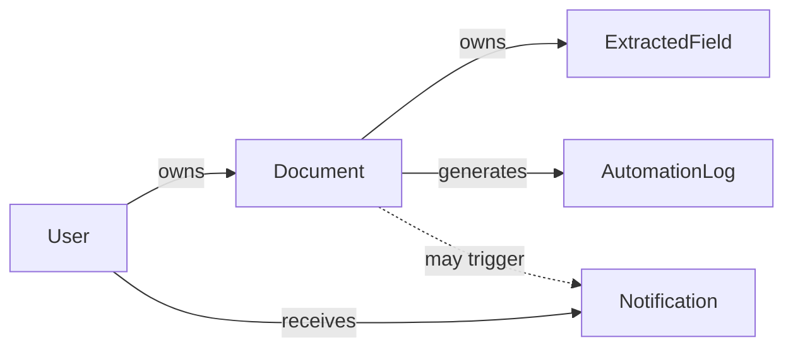
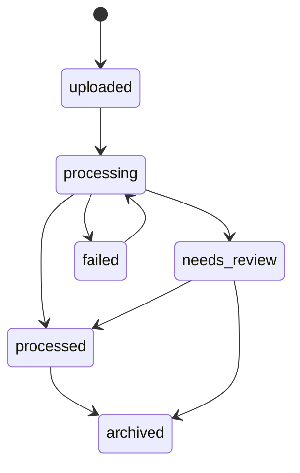

# Domain, Data & Security

| Field | Value |
|---|---|
| Doc ID | PAS-03 |
| Status | Frozen |
| Version | 1.0.0 |
| Last Updated | 2026-08-02 |
| Owners | Architecture / Security / Backend |

## Purpose

Define the conceptual domain model, entity ownership and lifecycles, authentication and session architecture, RBAC permission philosophy, admin seeding policy, data integrity and auditability rules, and Alembic-only schema evolution for Smart Document Workflow AI. This document is the authoritative Domain, Data & Security specification for PAS-04 through PAS-06.

## Audience

Backend engineers, security reviewers, and architects making changes that affect identity, authorization, persistence, or domain state.

## Scope

| In scope | Detail |
|---|---|
| Domain model | Conceptual entities and responsibilities (not ORM/SQL) |
| Ownership & integrity | Who owns what; immutability rules |
| Lifecycles | Document processing status, approval, field verification, notifications |
| Authentication | Access + refresh tokens, password hashing, session invalidation (high-level) |
| Authorization | Roles, permission matrix (capability-level, not endpoints) |
| Admin seeding | No public admin registration |
| Schema evolution | Alembic as sole migration mechanism |
| Security principles | Least privilege, ownership, auditability, secure defaults |

Topology, storage adapters, and API versioning remain owned by [02-system-architecture.md](./02-system-architecture.md). Product vision remains [01-vision-and-principles.md](./01-vision-and-principles.md).

### Domain model

The domain is not redesigned. The audited entities remain the core. Responsibilities are clarified so ownership is unambiguous.

| Entity | Responsibility | Owned by |
|---|---|---|
| User | Identity, credentials reference, role, active flag; account principal for ownership | Platform (self-registered `user` or seeded `admin`) |
| Document | Upload metadata, processing status, classification summary fields, approval status, link to binary object key (storage in PAS-02) | Creating User |
| Extracted Field | Named value extracted from a Document; verification flag | Parent Document |
| Notification | User-visible alert with read state | Recipient User (content produced by system events) |
| Automation Log | Immutable record of automation/pipeline actions related to a Document | System (append-only); associated Document |

**Data ownership principles**

1. A User owns their Documents; cascade delete of a User implies cascade of owned Documents and dependent children (unless a future retention policy says otherwise).
2. A Document owns its Extracted Fields and Automation Logs.
3. Notifications are addressed to a User; they are not owned by Documents as a parent aggregate, even when a Document event caused them.
4. Automation Logs are immutable after write: no update of meaning-bearing fields; corrections are new log entries if needed.
5. Server-side authorization always re-checks ownership or role—never trusts the client alone ([ADR-03-003](#adr-03-003-server-enforced-rbac-with-capability-matrix)).

### Entity lifecycles

Statuses are conceptual. Exact enum persistence and pipeline gates that *set* statuses are refined in PAS-04 where AI-driven; this document owns the allowed states and transition intent.

#### Document processing status

| State | Meaning |
|---|---|
| `uploaded` | Accepted; binary and metadata recorded; processing not finished |
| `processing` | Pipeline actively working |
| `processed` | Pipeline completed successfully at sufficient confidence |
| `needs_review` | Pipeline completed but human review is required |
| `failed` | Pipeline terminated in error |
| `archived` | Soft end-of-life; hidden from default lists (future operational use) |

Conceptual transitions:

Re-processing from `failed` (or controlled re-run) is an operational capability; mechanics belong with pipeline/ops, not invented here.

#### Approval lifecycle

Separate from processing status. Captures business acceptance of the Document as a whole.

| State | Meaning |
|---|---|
| `pending` | Awaiting approval decision |
| `approved` | Accepted by an authorized actor |
| `rejected` | Declined by an authorized actor |

Transitions: `pending` → `approved` | `rejected`. Re-opening a decided Document is an explicit admin action (not silent overwrite). Who may approve is defined in the permission matrix below—not left to “any authenticated user.”

#### Extracted Field verification lifecycle

| State | Meaning |
|---|---|
| Unverified | Created by extraction; `is_verified` false |
| Verified | Human confirmed or corrected value; `is_verified` true |

Transition: Unverified → Verified via authorized review action (value may be edited at verification time). Un-verifying is discouraged; corrections after verification create a new verified value under audit (implementation may log; pipeline use of verified fields is PAS-04).

#### Notification lifecycle

| State | Meaning |
|---|---|
| Unread | Created for a User |
| Read | Marked read by that User (or admin acting under policy) |

Notifications are not deleted as the primary UX; archival/dismissal may be added later without changing ownership.

### Authentication architecture

| Element | Target architecture |
|---|---|
| Access token | Short-lived JWT carrying subject (`sub` = user id) and role claim for coarse client hints |
| Refresh token | Longer-lived opaque or rotating credential stored server-side (or as rotating JWT with server-side revocation list); used only to obtain new access tokens |
| Password | Strong one-way hash (bcrypt or better successor); never store plaintext |
| Session strategy | Stateless access tokens + refresh rotation; logout / password change invalidates refresh tokens |
| Inactive users | `is_active = false` must reject authentication and refresh |

**Token rotation:** Each refresh issues a new refresh token and invalidates the previous one (reuse detection may revoke the family). Access tokens are not refreshed by extending the same JWT without rotation.

**Client storage of tokens** is a PAS-05 concern; this document requires that refresh tokens be treated as secrets and that the backend remain the authority for revocation.

Mechanics of libraries and claim names beyond the above are implementation details—not specified as code here.

### RBAC

**Roles (MVP)**

| Role | How created | Product responsibility |
|---|---|---|
| `user` | Self-registration (signup) | Own documents, own notifications, participate in review of own documents as product allows |
| `admin` | Seeded into the database only—never via public signup | Cross-user document visibility, approval decisions, platform integrity actions |

Frontend role-based routing (PAS-05) is UX only. **Authorization is enforced server-side** on every protected capability ([ADR-03-003](#adr-03-003-server-enforced-rbac-with-capability-matrix)).

**Permission matrix (capability-level)**

| Capability | `user` | `admin` |
|---|---|---|
| Register account | Yes | No (admins are seeded) |
| Authenticate / refresh session | Yes if active | Yes if active |
| Upload document | Yes (becomes owner) | Yes |
| List own documents | Yes | Yes |
| List all documents | No | Yes |
| List pending approvals (global) | No | Yes |
| Approve / reject document | No | Yes |
| View extracted fields of own document | Yes | Yes |
| View extracted fields of any document | No | Yes |
| Verify / edit extracted field on own document | Yes | Yes |
| Verify / edit extracted field on any document | No | Yes |
| Read own notifications / mark read | Yes | Yes |
| Read any user’s notifications | No | Yes (support/ops; use sparingly) |
| Seed or promote admins via public API | No | No (ops/seed process only) |

Endpoint-level binding is implementation; capabilities above are the authorization source of truth.

### Admin seeding policy

| Rule | Reasoning |
|---|---|
| No admin signup UI or public register-as-admin | Prevents privilege escalation and internet-facing admin creation |
| Admins are inserted/updated via controlled seed or secure ops process | Matches least privilege and known-operator model for early SaaS |
| Promoting `user` → `admin` is an offline/ops action, not a self-service API | Keeps the attack surface minimal |

See [ADR-03-001](#adr-03-001-user-only-public-registration) and [ADR-03-002](#adr-03-002-seeded-administrators-only).

### Schema evolution (Alembic)

| Topic | Policy |
|---|---|
| Sole mechanism | Alembic revisions are the only supported way to change production schema |
| Forbidden | Relying on `Base.metadata.create_all()` as the production migration path |
| Autogenerate | Wired to application metadata; revisions reviewed before apply |
| Environments | Migrate forward in deploy pipeline (PAS-06 owns when); never “hope import created tables” |

See [ADR-03-005](#adr-03-005-alembic-as-sole-schema-evolution-mechanism).

### Data integrity and auditability

- Prefer constrained status/role values (enums or check constraints) over free-form strings at the persistence boundary.
- Foreign keys enforce Document → User, Field → Document, Log → Document, Notification → User.
- Automation Logs are append-only ([ADR-03-006](#adr-03-006-immutable-automation-logs)).
- Security-sensitive actions (login failure bursts, approval, role changes via ops) should be attributable; application Automation Logs cover pipeline/automation; broader security logging is an ops concern (PAS-06) but must not contradict immutability of automation history.

### Security principles

| Principle | Why |
|---|---|
| Least privilege | Users see and mutate only what they own unless admin capability applies |
| Defense in depth | FE route guards are not sufficient; backend re-authorizes |
| Secure defaults | New users are `user` + active; approval starts `pending`; fields start unverified |
| Principle of ownership | Data access follows aggregate ownership rules above |
| Immutable audit logs | Automation history cannot be silently rewritten |
| Server-side authorization | Tokens prove identity; permissions are evaluated per capability |
| Input validation | All mutating inputs validated at the application boundary (Pydantic at impl time) |
| Secrets management | Secrets in environment/secret store—not in source control |
| Password hashing | One-way, modern KDF; no reversible password storage |
| Refresh token rotation | Limits replay window if a refresh token leaks |

## Out of Scope

| Topic | Owner |
|---|---|
| Modular monolith topology, Supabase, job infra, `/api/v1` | [02-system-architecture.md](./02-system-architecture.md) |
| Pipeline stages, confidence thresholds, workflow execution | [04-ai-pipeline-and-workflows.md](./04-ai-pipeline-and-workflows.md) |
| Login/signup page IA, token storage in browser, role-based UI routes | [05-frontend-experience.md](./05-frontend-experience.md) |
| CI/CD, Compose, seed script packaging in deploy | [06-engineering-and-operations.md](./06-engineering-and-operations.md) |
| Endpoint inventories and OpenAPI | Implementation / FastAPI generation |

## Assumptions

- Existing five entities remain the MVP domain; no greenfield domain rewrite ([ADR-01-001](./01-vision-and-principles.md#adr-01-001-evolve-existing-system-no-greenfield-rewrite)).
- PostgreSQL is the system of record for metadata ([ADR-02-005](./02-system-architecture.md#adr-02-005-postgresql-as-metadata-system-of-record)).
- Binary objects live in object storage; Document holds references only ([ADR-02-002](./02-system-architecture.md#adr-02-002-supabase-storage-for-document-binaries)).
- Human-in-the-loop remains a product principle ([ADR-01-003](./01-vision-and-principles.md#adr-01-003-human-in-the-loop-as-core-product-principle)); this document supplies the field/approval state model that enables it.

## Dependencies

| Type | Reference |
|---|---|
| Hard | [01-vision-and-principles.md](./01-vision-and-principles.md), [02-system-architecture.md](./02-system-architecture.md) |
| Standards | [DOCUMENTATION_STANDARDS.md](./DOCUMENTATION_STANDARDS.md), [README.md](./README.md) |
| Current-state context | [AUDIT_REPORT.md](../audit/AUDIT_REPORT.md) |

## Context

Per the audit: Users, Documents, Extracted Fields, Notifications, and Automation Logs already exist. Authentication is access-JWT only (no refresh). RBAC is a string role with a single admin list check; review routes lack authentication; approve/reject are not scoped. Schema creation uses fragile `create_all()` rather than Alembic revisions. This document defines the target domain and security posture that closes those gaps without renaming or discarding the core entities.

## Architecture Decisions

### ADR-03-001: User-only public registration

| Field | Value |
|---|---|
| Decision ID | ADR-03-001 |
| Decision | Public registration creates only the `user` role; there is no public path to create `admin` |
| Context | Product requires one signup for end users and a separate, controlled admin population |
| Alternatives Considered | Role selectable at signup; invite-only for all; user-only public registration |
| Trade-offs | Ops must seed admins; attackers cannot self-elevate via register |
| Reasoning | Least privilege and PAS-01 security-by-design; matches “no admin signup” product rule |
| Status | Accepted |
| Owner | Security / Product |

**Supersedes:** —

### ADR-03-002: Seeded administrators only

| Field | Value |
|---|---|
| Decision ID | ADR-03-002 |
| Decision | Administrator accounts are created only via controlled database seed or secure operational process—not via the public API or UI |
| Context | Early SaaS needs known operators without exposing an admin registration surface |
| Alternatives Considered | First-user-becomes-admin; admin invite links; seeded admins only |
| Trade-offs | Slightly higher ops friction; much smaller attack surface |
| Reasoning | Prevents internet-facing privilege creation; aligns with small-team operation |
| Status | Accepted |
| Owner | Security |

**Supersedes:** —

### ADR-03-003: Server-enforced RBAC with capability matrix

| Field | Value |
|---|---|
| Decision ID | ADR-03-003 |
| Decision | Authorization uses roles `user` and `admin` evaluated server-side against the capability matrix in this document; frontend routing is non-authoritative |
| Context | Audit shows missing auth on review and unscoped approve/reject—capability rules must be explicit |
| Alternatives Considered | Client-only guards; per-endpoint ad hoc checks without matrix; capability matrix + server enforcement |
| Trade-offs | Requires consistent dependency usage on every protected capability; matrix must be maintained |
| Reasoning | Defense in depth; closes known authorization gaps; keeps endpoint lists out of PAS |
| Status | Accepted |
| Owner | Security |

**Supersedes:** —

### ADR-03-004: Access JWT plus rotating refresh tokens

| Field | Value |
|---|---|
| Decision ID | ADR-03-004 |
| Decision | Authentication uses short-lived JWT access tokens plus refresh tokens with rotation and server-side invalidation on logout/password change/inactive user |
| Context | Access-only JWT forces long lifetimes or poor UX; SaaS needs revocation and shorter access exposure |
| Alternatives Considered | Long-lived access JWT only; server sessions only; access + rotating refresh |
| Trade-offs | Refresh store/rotation complexity; better security and session control |
| Reasoning | Industry-standard SPA/API pattern; supports PAS-05 client without making FE the authority |
| Status | Accepted |
| Owner | Security |

**Supersedes:** —

### ADR-03-005: Alembic as sole schema evolution mechanism

| Field | Value |
|---|---|
| Decision ID | ADR-03-005 |
| Decision | All schema changes in shared/deployed environments are applied via Alembic revisions; `create_all()` is not a production migration strategy |
| Context | Audit shows create_all import-order bugs and zero migration revisions |
| Alternatives Considered | Keep create_all; manual SQL; Alembic-only |
| Trade-offs | Requires discipline and CI migrate step; eliminates non-deterministic schemas |
| Reasoning | Repeatable environments; aligns with Production Readiness (ADR-01-004) and PostgreSQL SoR (ADR-02-005) |
| Status | Accepted |
| Owner | Architecture |

**Supersedes:** —

### ADR-03-006: Immutable automation logs

| Field | Value |
|---|---|
| Decision ID | ADR-03-006 |
| Decision | Automation Log records are append-only; meaning-bearing fields are not updated in place |
| Context | Trust in pipeline and workflow history requires non-repudiation of recorded actions |
| Alternatives Considered | Mutable status edits; delete-and-replace; append-only logs |
| Trade-offs | Corrections require new entries; storage grows monotonically |
| Reasoning | Supports auditability and human-in-the-loop accountability |
| Status | Accepted |
| Owner | Architecture / Security |

**Supersedes:** —

### ADR-03-007: Ownership-scoped document and field access

| Field | Value |
|---|---|
| Decision ID | ADR-03-007 |
| Decision | Non-admin actors may access Documents and Extracted Fields only when they own the parent Document; admins may access across users per the capability matrix |
| Context | Audit allows any authenticated user to approve/reject any document and leaves review unauthenticated |
| Alternatives Considered | Global access for all authenticated users; ownership-scoped user access + admin override |
| Trade-offs | Slightly more query filters; correct multi-user SaaS behavior |
| Reasoning | Principle of ownership; required for multi-user production |
| Status | Accepted |
| Owner | Security |

**Supersedes:** —

## Current → Recommended → Migration

### Authentication

#### Current

Access JWT only; bcrypt password hashing present; no refresh; no standardized logout/revocation.

#### Recommended

Short-lived access JWT + rotating refresh tokens; inactive users rejected; logout invalidates refresh ([ADR-03-004](#adr-03-004-access-jwt-plus-rotating-refresh-tokens)).

#### Migration

Add refresh token persistence (or rotating refresh with revocation); issue refresh on login; add refresh and logout capabilities; shorten access TTL; migrate clients (PAS-05) to the new pair.

### Authorization

#### Current

Single inline admin check on one list capability; review unauthenticated; approve/reject unscoped.

#### Recommended

Enforce capability matrix server-side; ownership scoping for users; admin-only global approve/list ([ADR-03-003](#adr-03-003-server-enforced-rbac-with-capability-matrix), [ADR-03-007](#adr-03-007-ownership-scoped-document-and-field-access)).

#### Migration

Introduce shared authz dependencies; lock review and approval capabilities; remove dead/broken duplicate auth helpers; verify with tests (PAS-06).

### Admin creation

#### Current

Role is a free string defaulting to `user`; no formal seed policy in architecture.

#### Recommended

Public registration → `user` only; admins seeded only ([ADR-03-001](#adr-03-001-user-only-public-registration), [ADR-03-002](#adr-03-002-seeded-administrators-only)).

#### Migration

Ensure register path cannot set role; add controlled seed for initial admin; document ops procedure (PAS-06).

### Database migrations

#### Current

`create_all()` at import / init script; Alembic unwired; no revisions.

#### Recommended

Alembic-only schema evolution ([ADR-03-005](#adr-03-005-alembic-as-sole-schema-evolution-mechanism)).

#### Migration

Wire metadata; baseline revision matching actual DB; remove production dependence on create_all; apply migrations in deploy (PAS-06).

### Status handling

#### Current

Free-form strings for `status`, `approval_status`, role; dual concepts partially used.

#### Recommended

Constrained processing status, approval status, and verification flag as defined in lifecycles; role limited to `user` | `admin`.

#### Migration

Normalize existing rows; add DB/app constraints via Alembic; align pipeline writers (PAS-04) to the state machine.

## Risks

| Risk | Mitigation |
|---|---|
| Refresh token theft | Rotation + reuse detection; short access TTL; secure client storage (PAS-05) |
| Authz regressions | Central capability checks; automated tests for matrix cells |
| Migration lock-in failure | Baseline Alembic early; ban create_all in production config |
| Over-powered admin | Capability matrix; audit admin actions in ops logging |
| Lifecycle confusion (status vs approval) | Keep dual fields; document transitions; PAS-04 sets processing status only |

## Trade-offs

| Choice | Benefit | Cost |
|---|---|---|
| ADR-03-002 Seeded admins | Small attack surface | Ops seed process |
| ADR-03-004 Refresh tokens | Better session security/UX | Persistence + rotation logic |
| ADR-03-005 Alembic-only | Deterministic schemas | Discipline and pipeline step |
| ADR-03-007 Ownership scope | Correct multi-user SaaS | More authorization branches |
| Dual status vs approval | Separates AI outcome from business decision | Two fields to teach/maintain |

## Future Considerations

Extension points only—do not redesign MVP entities now:

- Organization / multi-tenancy (Documents owned by org; users as members)
- Teams and delegated ownership
- API keys for machine clients
- External IdP / SSO
- Billing Account linked to Organization
- Fine-grained roles beyond `user` / `admin` (e.g. reviewer)

When introduced, extend the capability matrix and ownership rules; prefer additive Alembic migrations.

## Frozen Decisions

Decision IDs locked by this Frozen document:

- [x] ADR-03-001 — User-only public registration
- [x] ADR-03-002 — Seeded administrators only
- [x] ADR-03-003 — Server-enforced RBAC with capability matrix
- [x] ADR-03-004 — Access JWT plus rotating refresh tokens
- [x] ADR-03-005 — Alembic as sole schema evolution mechanism
- [x] ADR-03-006 — Immutable automation logs
- [x] ADR-03-007 — Ownership-scoped document and field access

## Changelog

| Date | Version | Summary |
|---|---|---|
| 2026-08-02 | 0.1.0 | Initial draft for architectural review |
| 2026-08-02 | 1.0.0 | Official freeze after architectural review approval |
