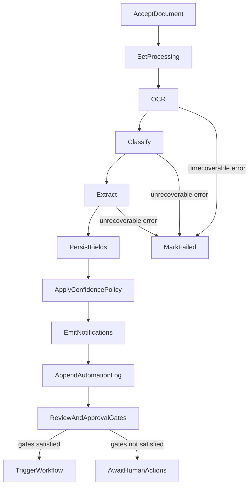

# AI Pipeline & Workflows

| Field | Value |
|---|---|
| Doc ID | PAS-04 |
| Status | Frozen |
| Version | 1.0.0 |
| Last Updated | 2026-08-02 |
| Owners | Architecture / AI / Backend |

## Purpose

Define the document intelligence pipeline and workflow automation model for Smart Document Workflow AI: stage contracts, failure modes, confidence and human-in-the-loop policy, document-type strategy, OCR/ML/NLP responsibilities, workflow semantics, notification trigger events, and model artifact lifecycle. This document is the authoritative AI Pipeline & Workflows specification for PAS-05 and PAS-06.

## Audience

AI and backend engineers implementing or changing processing behavior; product stakeholders responsible for review UX and confidence policy.

## Scope

| In scope | Detail |
|---|---|
| Pipeline stages | Ordered contracts from accept-through-process to workflow eligibility |
| Failure modes | What sets `failed` and what is logged |
| Confidence / HITL policy | When `needs_review` vs `processed`; when workflows may run |
| Document types | MVP types and how new types are added |
| OCR / ML / NLP responsibilities | Stage inputs/outputs and limits (not library call sites) |
| Workflow semantics | Type-routed actions after gates; MVP vs later depth |
| Notification triggers | Which events create Notifications (entity shape remains PAS-03) |
| Model lifecycle | Train, package, load, version conceptually |

Job runner technology and storage adapters remain [02-system-architecture.md](./02-system-architecture.md). Entity statuses and RBAC remain [03-domain-data-and-security.md](./03-domain-data-and-security.md). Human-in-the-loop as a product principle remains [ADR-01-003](./01-vision-and-principles.md#adr-01-003-human-in-the-loop-as-core-product-principle).

### Pipeline overview

Processing is invoked after a Document is accepted (upload complete; binary stored; metadata persisted). Execution is asynchronous relative to the HTTP response via the job boundary ([ADR-02-004](./02-system-architecture.md#adr-02-004-evolve-background-processing-via-a-job-boundary)).

### Stage contracts

| Stage | Input | Output | Failure mode |
|---|---|---|---|
| Accept | Authenticated upload + validated file type/size (validation policy at API edge) | Document `uploaded`; object key; owner | Reject before job enqueue |
| Set processing | Document id | `status = processing` | Missing document → abort, log |
| OCR | Object reference / readable bytes | `raw_text` (full extracted text) | Unreadable/unsupported content → `failed` + automation log |
| Classify | `raw_text` | `document_type`, `confidence_score` | Model unavailable / empty text policy → `failed` or forced `needs_review` (see policy) |
| Extract | `document_type` + `raw_text` | Map of field name → value | Soft failure: empty map allowed; hard failure only on infrastructure crash |
| Persist fields | Extraction map | Extracted Field rows (`unverified`) | Persistence error → `failed` |
| Confidence policy | `confidence_score` | `processed` or `needs_review` | N/A (deterministic) |
| Notify | Document + outcome | Notification event(s) for owner (and admin queue signals as defined) | Notification write failure should not silently clear Document success; log and continue or fail per ops policy—prefer log+continue for non-critical notify |
| Automation log | Stage/outcome summary | Append-only Automation Log ([ADR-03-006](./03-domain-data-and-security.md#adr-03-006-immutable-automation-logs)) | Log write failure is serious; mark failed if history cannot be recorded after success path |
| Gates | Verification + approval state | Eligibility for workflow | Workflow skipped until gates pass |
| Workflow | Eligible Document | Type-routed side effects | Workflow errors logged; Document processing status already terminal |

Stages are sequential for MVP. Parallelism inside a stage (e.g. multi-page OCR) is an implementation optimization, not a contract change.

### Confidence and human-in-the-loop policy

| Rule | Decision |
|---|---|
| Score source | Classification `predict_proba` maximum (or successor model’s calibrated confidence) |
| Threshold | Configurable configuration value; default **0.70** for MVP continuity |
| Below threshold | Set Document processing status `needs_review` |
| At/above threshold | Set `processed` |
| Empty / near-empty OCR text | Treat as `needs_review` (or `failed` if OCR itself errored)—do not silently mark high confidence |
| Field verification | Does **not** auto-flip processing status; humans verify fields under PAS-03 lifecycle |
| Approval | Independent business decision (`pending` → `approved` / `rejected`) per PAS-03 |

Human-in-the-loop is mandatory as product posture ([ADR-01-003](./01-vision-and-principles.md#adr-01-003-human-in-the-loop-as-core-product-principle)). This document defines **when** the system requires review attention and **when** automation may proceed past gates ([ADR-04-002](#adr-04-002-configurable-confidence-threshold-and-review-status)).

### Workflow eligibility gates

Workflows must not run on first-pass unverified fields. Correct gate order:

1. Pipeline has finished with `processed` or `needs_review` (not `failed` / `processing`).
2. **Field gate:** required extracted fields for the document type are verified (type-specific required set; unknown/optional fields may remain unverified).
3. **Approval gate (MVP):** Document `approval_status = approved` before type workflows that imply business routing (finance/HR/internal).

Until gates pass, the Document remains eligible for human actions only; workflow is deferred, not permanently cancelled. Re-check gates after verification or approval events ([ADR-04-003](#adr-04-003-workflow-after-verification-and-approval-gates)).

This explicitly replaces the audited anti-pattern of checking `is_verified` immediately after creating unverified fields in the same pipeline pass.

### Document-type strategy

| Type | Classification label | Extraction focus (MVP) | Workflow lane |
|---|---|---|---|
| Resume | `Resume` | name, email, phone | HR / recruitment lane |
| Invoice | `Invoice` | invoice_number, amount, date | Finance approval lane |
| Form | `Form` | name, date, id | Internal processing lane |

**Extension rule:** New types require (a) labeled training data + model update, (b) extraction field contract, (c) required-field set for the field gate, (d) workflow lane stub or implementation, (e) notification copy if distinct. No silent empty extraction for unknown labels in production—unknown types → `needs_review` with empty or generic fields and an automation log ([ADR-04-004](#adr-04-004-closed-document-type-set-with-explicit-extension-path)).

### OCR responsibilities

| Concern | Architecture rule |
|---|---|
| Role | Produce `raw_text` from supported binaries |
| Supported inputs (MVP) | PDF; common raster images (PNG/JPEG) |
| Out of OCR scope | Classification, extraction, authz, storage policy |
| Quality | Best-effort text; no requirement to store per-page OCR confidence in MVP |
| Limits | Reject or fail oversized/unsupported files before or during OCR; do not treat arbitrary bytes as images without validation |

Preprocessing (deskew/denoise) is a future quality upgrade, not an MVP contract.

### ML classification responsibilities

| Concern | Architecture rule |
|---|---|
| Role | Assign `document_type` + `confidence_score` from `raw_text` |
| MVP model family | Classical text classifier (TF-IDF + linear model or equivalent) |
| Loading | Deterministic artifact path relative to application package/config—not process CWD |
| Versioning | Artifact identity (filename/version metadata) recorded conceptually; training remains offline script for MVP |
| Training data debt | Prefer incremental inclusion of real OCR text over synthetic-only sets over time |

### NLP extraction responsibilities

| Concern | Architecture rule |
|---|---|
| Role | Produce field map for the classified type using regex, NER, and heuristics |
| Soft incompleteness | Missing fields are allowed; they increase human review burden |
| Correctness bugs | Known resume-name NER dead path must be fixed as part of evolution—not left as silent failure |
| Non-goals for MVP | Full skills/experience graphs; LLM extraction as primary path |

### Workflow semantics

| Lane | MVP meaning | Side effects (MVP) |
|---|---|---|
| Invoice / Finance | Document approved and fields verified | Automation log “invoice workflow started”; notification to owner/admin as configured; placeholder for future payment queue |
| Resume / HR | Same gates | Log + notification; placeholder for candidate pipeline |
| Form / Internal | Same gates | Log + notification; placeholder for department routing |

MVP workflows are **real, observable side effects** (logs + notifications at minimum)—not `print()`-only stubs—and only after gates ([ADR-04-003](#adr-04-003-workflow-after-verification-and-approval-gates)). Deep integrations (email to ERP, webhooks) are Future Considerations.

### Notification triggers (events)

Notification **entity** remains PAS-03. This document owns **when** events fire:

| Event | Recipient | Intent |
|---|---|---|
| `document.processed` | Owner | Pipeline finished with `processed` |
| `document.needs_review` | Owner | Pipeline finished with `needs_review` |
| `document.failed` | Owner | Pipeline failed |
| `document.approved` | Owner | Admin approved |
| `document.rejected` | Owner | Admin rejected |
| `workflow.started` | Owner (and optionally admin) | Workflow lane began after gates |

Message copy must match the actual status (do not claim “requires review” when status is `processed`). API listing/mark-read remains a product surface concern (PAS-05) over PAS-03 entity.

### Model artifact lifecycle

| Phase | Rule |
|---|---|
| Train | Offline script against labeled dataset; evaluate before promote |
| Package | Versioned artifact (e.g. classifier + metadata); avoid undocumented CWD coupling |
| Deploy | Ship with release or mount as config-referenced file; SPACy model treated as dependency |
| Runtime load | Once per process at startup/lazy-init; fail fast if missing in non-dev |
| Retire | Replace via release; keep prior artifact until rollback window ends |

Detailed CI packaging is PAS-06; this document locks the lifecycle principles ([ADR-04-005](#adr-04-005-deterministic-model-artifact-loading-and-lifecycle)).

### Automation logging semantics

Each meaningful pipeline transition appends an Automation Log (immutable). Minimum events: processing started, OCR completed/failed, classified, extracted (field count), confidence decision, notify emitted, workflow started/skipped (with reason), pipeline failed.

## Out of Scope

| Topic | Owner |
|---|---|
| Job broker choice, storage adapter, `/api/v1` shape | [02-system-architecture.md](./02-system-architecture.md) |
| Entity schemas, RBAC matrix, token mechanics | [03-domain-data-and-security.md](./03-domain-data-and-security.md) |
| Review UI, dashboards, client token handling | [05-frontend-experience.md](./05-frontend-experience.md) |
| Deploy packaging, CI model publish, Compose | [06-engineering-and-operations.md](./06-engineering-and-operations.md) |
| Endpoint inventories | Implementation / OpenAPI |

## Assumptions

- Document processing and approval statuses from PAS-03 are the state vocabulary this pipeline writes and reads.
- Pipeline runs through the job boundary from PAS-02; stage order does not depend on a specific broker.
- MVP document types remain Resume, Invoice, Form.
- Human verification and admin approval are available as product capabilities (authz per PAS-03).

## Dependencies

| Type | Reference |
|---|---|
| Hard | [02-system-architecture.md](./02-system-architecture.md), [03-domain-data-and-security.md](./03-domain-data-and-security.md) |
| Soft / product | [01-vision-and-principles.md](./01-vision-and-principles.md) (HITL, readiness) |
| Standards | [DOCUMENTATION_STANDARDS.md](./DOCUMENTATION_STANDARDS.md), [README.md](./README.md) |
| Current-state context | [AUDIT_REPORT.md](../audit/AUDIT_REPORT.md) |

## Context

Per the audit: a sequential OCR → classify → extract pipeline exists and persists fields, notifications, and automation logs. Confidence threshold 0.7 is hardcoded. Workflow dispatch is print-only and effectively unreachable because verification is checked immediately after creating unverified fields. Resume name NER path is broken. Model path depends on process CWD. Notification copy always claims review is required. This document defines the target pipeline contracts that correct those behaviors without rewriting the modular monolith.

## Architecture Decisions

### ADR-04-001: Sequential stage pipeline with explicit contracts

| Field | Value |
|---|---|
| Decision ID | ADR-04-001 |
| Decision | Document intelligence runs as a sequential staged pipeline (OCR → classify → extract → persist → confidence policy → notify/log → gates → workflow) with explicit inputs, outputs, and failure modes per stage |
| Context | Audited code already sequences these steps in one orchestrator; contracts were implicit and mixed with bugs |
| Alternatives Considered | Event-sourced stage bus; fully parallel DAG; sequential contracts |
| Trade-offs | Sequential is simpler to reason about; less throughput than a DAG for independent work |
| Reasoning | Matches Modular Monolith and KISS; sufficient for MVP document types; aligns with existing orchestration shape |
| Status | Accepted |
| Owner | Architecture / AI |

**Supersedes:** —

### ADR-04-002: Configurable confidence threshold and review status

| Field | Value |
|---|---|
| Decision ID | ADR-04-002 |
| Decision | Classification confidence below a configurable threshold (default 0.70) sets `needs_review`; at/above sets `processed`. Empty OCR text must not be treated as high-confidence success |
| Context | Hardcoded 0.7 and weak empty-text handling reduce operability and trust |
| Alternatives Considered | Always review; never review; fixed constant forever; configurable threshold with default 0.70 |
| Trade-offs | Configurability needs safe defaults and docs; fixed constant is simpler but brittle |
| Reasoning | Supports HITL (ADR-01-003) and production tuning without code edits for every threshold experiment |
| Status | Accepted |
| Owner | Product / AI |

**Supersedes:** —

### ADR-04-003: Workflow after verification and approval gates

| Field | Value |
|---|---|
| Decision ID | ADR-04-003 |
| Decision | Type-routed workflows run only after pipeline completion and after field-verification and approval gates are satisfied; gate checks are re-evaluated when humans verify fields or approve documents—not inside the initial extraction pass |
| Context | Audit shows workflows unreachable due to same-pass verified-field check; stubs print only |
| Alternatives Considered | Workflow immediately after classify; workflow after extract without approval; gated workflow as specified |
| Trade-offs | Longer time-to-automation; correct accountability and HITL |
| Reasoning | Separates AI completion from business routing; fixes the logical bug; MVP side effects are logs + notifications at minimum |
| Status | Accepted |
| Owner | Architecture / Product |

**Supersedes:** —

### ADR-04-004: Closed document-type set with explicit extension path

| Field | Value |
|---|---|
| Decision ID | ADR-04-004 |
| Decision | MVP supports Resume, Invoice, and Form only. Unknown types require review. New types follow an explicit extension checklist (data, model, extraction contract, required fields, workflow lane) |
| Context | Three-class model and extractors already exist; open-ended types without contracts create silent empty extractions |
| Alternatives Considered | Open taxonomy; LLM-only typing; closed set + extension path |
| Trade-offs | Slower to add types; higher reliability per type |
| Reasoning | Aligns training, extraction, and workflows; prevents silent degradation |
| Status | Accepted |
| Owner | AI / Product |

**Supersedes:** —

### ADR-04-005: Deterministic model artifact loading and lifecycle

| Field | Value |
|---|---|
| Decision ID | ADR-04-005 |
| Decision | Classifier (and related) artifacts load via configuration or package-relative paths with a defined train → package → deploy → load → retire lifecycle; process CWD must not be the sole resolution mechanism |
| Context | Audited loader depends on `os.getcwd()`, causing environment fragility |
| Alternatives Considered | CWD-relative load; remote model service; config/package-relative artifacts |
| Trade-offs | Slightly more packaging discipline; far fewer runtime surprises |
| Reasoning | Production readiness (ADR-01-004); small-team operability |
| Status | Accepted |
| Owner | Architecture / AI |

**Supersedes:** —

### ADR-04-006: Status-accurate notification trigger catalog

| Field | Value |
|---|---|
| Decision ID | ADR-04-006 |
| Decision | Notifications are emitted from a defined event catalog (`document.processed`, `document.needs_review`, `document.failed`, approval and workflow events) with copy matching actual Document state |
| Context | Audit creates a single generic “requires review” notification even when status is `processed` |
| Alternatives Considered | Single generic notify; email-only; event catalog with accurate copy |
| Trade-offs | More event types to maintain; clearer user trust |
| Reasoning | Notification triggers are PAS-04 owned; entity remains PAS-03; UX listing is PAS-05 |
| Status | Accepted |
| Owner | Product / Architecture |

**Supersedes:** —

## Current → Recommended → Migration

### Pipeline orchestration

#### Current

Single orchestrator function; sequential stages; workflow check broken; print stubs.

#### Recommended

Same sequential shape with explicit stage contracts, correct gates, real workflow side effects (log + notify minimum) ([ADR-04-001](#adr-04-001-sequential-stage-pipeline-with-explicit-contracts), [ADR-04-003](#adr-04-003-workflow-after-verification-and-approval-gates)).

#### Migration

Refactor gate logic out of the initial pass; invoke workflow on verification/approval domain events; replace print stubs; keep modules inside the monolith.

### Confidence policy

#### Current

Hardcoded `0.7`; weak empty-text handling.

#### Recommended

Configurable threshold defaulting to 0.70; empty OCR → review/fail policy ([ADR-04-002](#adr-04-002-configurable-confidence-threshold-and-review-status)).

#### Migration

Externalize threshold to settings; add empty-text branch; document default in ops config (PAS-06).

### Extraction quality

#### Current

Resume NER name path effectively dead; limited fields.

#### Recommended

Fix name extraction path; keep MVP field sets; treat incompleteness as review signal.

#### Migration

Correct extractor logic; add focused tests; do not expand to LLM-first without a new ADR.

### Model loading

#### Current

CWD-relative `document_classifier.pkl`.

#### Recommended

Config/package-relative deterministic load ([ADR-04-005](#adr-04-005-deterministic-model-artifact-loading-and-lifecycle)).

#### Migration

Change load path resolution; fail fast on missing artifact in deployed envs; keep local dev ergonomics via config.

### Notifications

#### Current

One generic post-process notification; inaccurate copy; no event catalog.

#### Recommended

Event catalog with status-accurate copy ([ADR-04-006](#adr-04-006-status-accurate-notification-trigger-catalog)).

#### Migration

Emit distinct events; adjust messages; expose list/read in product API/UI (PAS-05) without changing trigger ownership.

## Risks

| Risk | Mitigation |
|---|---|
| Gate friction delays automation | Clear required-field sets; admin bulk tools later; measure time-to-approve |
| Threshold mis-tuning | Default 0.70; monitor needs_review rate; adjust via config |
| Workflow side effects grow ad hoc | Keep lanes thin; new integrations need ADR/extension checklist |
| Model/data drift | Retrain with OCR-like samples; record artifact version |
| Partial notify on success | Prefer log+continue for notify failures; alert ops |

## Trade-offs

| Choice | Benefit | Cost |
|---|---|---|
| ADR-04-001 Sequential stages | Clarity, debuggability | Less parallel speedup |
| ADR-04-003 Gated workflows | Trust, fixes audit bug | Slower auto-routing |
| ADR-04-004 Closed types | Reliability | Explicit work to add types |
| ADR-04-005 Deterministic artifacts | Operability | Packaging discipline |
| Classical ML + regex/NER | Fits current stack and team | Lower ceiling than LLM extraction |

## Future Considerations

- LLM-assisted extraction as an optional stage behind a new ADR
- Per-field confidence scores
- Active learning from verified corrections
- Webhook / external system workflow actions
- Multi-language OCR
- Richer document-type taxonomy (contracts via ADR-04-004 checklist)

## Frozen Decisions

Decision IDs locked by this Frozen document:

- [x] ADR-04-001 — Sequential stage pipeline with explicit contracts
- [x] ADR-04-002 — Configurable confidence threshold and review status
- [x] ADR-04-003 — Workflow after verification and approval gates
- [x] ADR-04-004 — Closed document-type set with explicit extension path
- [x] ADR-04-005 — Deterministic model artifact loading and lifecycle
- [x] ADR-04-006 — Status-accurate notification trigger catalog

## Changelog

| Date | Version | Summary |
|---|---|---|
| 2026-08-02 | 0.1.0 | Initial draft for architectural review |
| 2026-08-02 | 1.0.0 | Official freeze after architectural review approval |
