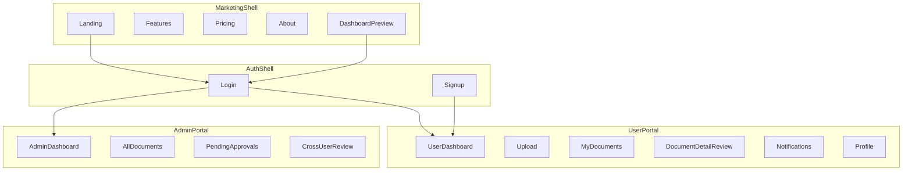

# Frontend Experience

| Field | Value |
|---|---|
| Doc ID | PAS-05 |
| Status | Frozen |
| Version | 1.0.0 |
| Last Updated | 2026-08-02 |
| Owners | Architecture / Frontend / Product |

## Purpose

Define the Next.js product surfaces, information architecture, auth UX, role-based portals, API client consumption, browser token handling, and UI system for Smart Document Workflow AI. This document is the authoritative Frontend Experience specification for PAS-06 and for frontend implementation.

## Audience

Frontend engineers and product/design stakeholders building or reviewing the web application.

## Scope

| In scope | Detail |
|---|---|
| App shape | Single Next.js App Router + TypeScript application |
| Public IA | Landing, Features, Pricing, About, Dashboard Preview |
| Auth surfaces | Shared Login; user-only Signup; post-login role routing |
| Portals | User Dashboard and Admin Dashboard feature maps |
| Guards | Client route guards + redirect-to-Login with return URL |
| API consumption | Axios + TanStack Query against `/api/v1` |
| Browser tokens | Access in memory; refresh via httpOnly cookie through Next.js BFF |
| UI system | Tailwind, ShadCN, RHF + Zod, purposeful Framer Motion |
| A11y / responsive | Baseline expectations for portals |

Server authorization, pipeline gates, and deploy/CI remain owned elsewhere. Frontend routing is UX only—not the authority for permissions ([ADR-03-003](./03-domain-data-and-security.md#adr-03-003-server-enforced-rbac-with-capability-matrix)).

### Information architecture

One frontend app serves marketing and product shells ([ADR-05-001](#adr-05-001-single-nextjs-app-router-frontend)).

| Shell | Conceptual route group | Audience |
|---|---|---|
| Marketing | `(marketing)` | Visitors |
| Auth | `(auth)` | Unauthenticated users completing Login/Signup |
| User portal | `(user)` | Authenticated `user` (and admins who may also use user-scoped views when useful) |
| Admin portal | `(admin)` | Authenticated `admin` |



Public pages educate and convert; they do not expose live private data. Dashboard Preview is illustrative, not a substitute for authenticated dashboards ([PAS-01 public vs authenticated surfaces](./01-vision-and-principles.md)).

### Auth surfaces

| Surface | Who | Rules |
|---|---|---|
| Login | `user` and `admin` | Single shared page; no separate admin login URL required |
| Signup | New end users only | Creates `user` role accounts only; no admin registration UI ([ADR-03-001](./03-domain-data-and-security.md#adr-03-001-user-only-public-registration), [ADR-03-002](./03-domain-data-and-security.md#adr-03-002-seeded-administrators-only)) |
| Post-login routing | All authenticated sessions | Resolve role (prefer authoritative `/auth/me` after login); send `admin` → Admin Dashboard, `user` → User Dashboard ([ADR-05-002](#adr-05-002-shared-login-user-only-signup-role-based-routing)) |

Seeded administrators use Login only. Role claim on the access token may be used as a UX hint; the client must refresh identity from the API before granting portal chrome.

```mermaid
sequenceDiagram
  participant Browser
  participant Nextjs
  participant Bff as NextBffAuth
  participant Api as FastAPIv1

  Browser->>Nextjs: Hit protected route unauthenticated
  Nextjs->>Browser: Redirect Login with returnUrl
  Browser->>Nextjs: Submit Login
  Nextjs->>Bff: Proxy credentials
  Bff->>Api: Auth login
  Api-->>Bff: Access plus refresh
  Bff-->>Browser: Set httpOnly refresh cookie; return access to client memory
  Browser->>Api: GET me with Bearer access
  Api-->>Browser: User plus role
  Browser->>Nextjs: Route to User or Admin dashboard
```

### Protected actions and Return URL

Unauthenticated attempts to use Upload, Documents, Notifications, Profile, or either dashboard redirect to Login with a safe return URL ([ADR-05-003](#adr-05-003-protected-actions-redirect-to-login-with-return-url)). After successful login, navigate to the return URL if it is an internal path; otherwise fall back to the role default dashboard.

### User portal feature map

| Area | Purpose | PAS references (consume, do not redefine) |
|---|---|---|
| User Dashboard | Summary of own documents, statuses, recent notifications | Processing / approval statuses (PAS-03) |
| Upload | Submit document binary via API | Storage mediated by backend (PAS-02) |
| My Documents | List own documents with status chips (`uploaded`, `processing`, `processed`, `needs_review`, `failed`) | PAS-03 / PAS-04 |
| Document detail / field review | View extracted fields; edit/verify when authorized | Field verification lifecycle (PAS-03); HITL (PAS-01/04) |
| Notifications | List own notifications; mark read | Triggers from PAS-04; entity PAS-03 |
| Profile | View account basics; logout | Session invalidation (PAS-03) |

Review UI must reflect `needs_review` and unverified fields as actionable—not invent new pipeline gates.

### Admin portal feature map

| Area | Purpose |
|---|---|
| Admin Dashboard | Cross-user operational overview |
| All Documents | Global document list |
| Pending Approvals | Queue by `approval_status = pending` |
| Approve / Reject | Business decision actions (admin capability) |
| Cross-user field review | View/verify fields on any document per PAS-03 matrix |
| Notifications (ops) | Support-oriented views only as allowed by capability matrix—default to disciplined use |

Admins landing on Admin Dashboard may deep-link into user-scoped document detail when investigating a case. Client hides admin nav from `user` roles; API still enforces.

### Guard model

| Layer | Role |
|---|---|
| Next.js middleware / layout guards | UX: redirect unauthenticated users; redirect `user` away from `(admin)` chrome |
| Server (FastAPI) | Authoritative authorization on every capability |

Never treat missing admin nav as security. A forged client must still receive `403` from the API.

### API consumption

| Rule | Detail |
|---|---|
| Base path | `/api/v1` ([ADR-02-003](./02-system-architecture.md#adr-02-003-versioned-rest-api-under-apiv1)) |
| Client | Single Axios instance shared across the app ([ADR-05-004](#adr-05-004-tanstack-query-and-axios-for-apiv1)) |
| Server state | TanStack Query; query keys namespaced by domain (`documents`, `notifications`, `auth`, `review`) |
| Mutations | Invalidate related queries on success |
| Upload | `multipart/form-data` to Documents API; no direct browser→Supabase requirement for MVP (backend mediates per PAS-02) |
| Errors | Map API error envelope to user-visible toasts/inline errors; do not leak stack traces |

Endpoint catalogs are not PAS content; OpenAPI from FastAPI remains the implementation contract.

### Browser token handling

| Token | Storage | Usage |
|---|---|---|
| Access | In-memory (client runtime) | `Authorization: Bearer` on API calls |
| Refresh | `httpOnly` + `Secure` + `SameSite` cookie | Set/cleared only via Next.js Route Handler BFF that proxies FastAPI auth |

Silent refresh: on `401`, BFF refresh route rotates refresh cookie and returns new access token to memory; retry original request once. Logout clears memory access and BFF clears refresh cookie. Inactive users fail refresh and return to Login ([ADR-05-005](#adr-05-005-memory-access-token-and-httponly-refresh-via-bff), [ADR-03-004](./03-domain-data-and-security.md#adr-03-004-access-jwt-plus-rotating-refresh-tokens)).

Do not store refresh tokens in `localStorage` or expose them to JavaScript.

### UI system and motion

| Concern | Choice |
|---|---|
| Styling | Tailwind CSS with CSS variables for brand tokens |
| Components | ShadCN UI as the default component kit |
| Forms | React Hook Form + Zod schemas aligned to API validation |
| Motion | Framer Motion for purposeful hierarchy only ([ADR-05-006](#adr-05-006-tailwind-shadcn-rhf-zod-purposeful-motion)) |

**Motion budget (minimum intentional set):**

1. Auth/marketing page enter (subtle opacity/translate).
2. Document list / status chip transitions when processing status changes.
3. Dashboard section reveal—not continuous ambient animation.

Avoid decorative noise, emoji-driven UI, and default “AI purple glow” tropes unless brand explicitly defines otherwise in a later design pass.

### Accessibility and responsiveness

- Keyboard-reachable primary flows (login, upload, review, approve).
- Prefer ShadCN/Radix accessible primitives for dialogs, menus, and forms.
- Portals usable on mobile viewports; admin tables may scroll horizontally rather than hide critical actions.
- Status is never color-only (pair with text labels).

### Greenfield frontend migration

Replace the empty `frontend/` tree with a Next.js App Router application. Do not revive the deleted Vite/React scaffold. Wire environment config for API base URL; implement BFF auth route handlers before shipping authenticated portals. Build/deploy pipeline ownership is PAS-06.

## Out of Scope

| Topic | Owner |
|---|---|
| Product vision, personas, non-goals | [01-vision-and-principles.md](./01-vision-and-principles.md) |
| Modular monolith topology, storage, job infra, API versioning philosophy | [02-system-architecture.md](./02-system-architecture.md) |
| RBAC matrix, JWT/refresh mechanics (server), Alembic | [03-domain-data-and-security.md](./03-domain-data-and-security.md) |
| Pipeline stages, confidence thresholds, workflow gates | [04-ai-pipeline-and-workflows.md](./04-ai-pipeline-and-workflows.md) |
| CI/CD, Docker Compose, FE deploy environments | [06-engineering-and-operations.md](./06-engineering-and-operations.md) |

## Assumptions

- PAS-01 through PAS-04 decisions remain in force.
- Backend will expose versioned `/api/v1` auth (login, refresh, me, logout) compatible with the BFF cookie pattern.
- Admins exist only via seed/ops; Signup never offers an admin role.
- Empty frontend is the starting point (audit).

## Dependencies

| Type | Reference |
|---|---|
| Hard | [01-vision-and-principles.md](./01-vision-and-principles.md), [02-system-architecture.md](./02-system-architecture.md), [03-domain-data-and-security.md](./03-domain-data-and-security.md) |
| Soft | [04-ai-pipeline-and-workflows.md](./04-ai-pipeline-and-workflows.md) (review/status UX concepts only) |
| Standards | [DOCUMENTATION_STANDARDS.md](./DOCUMENTATION_STANDARDS.md), [README.md](./README.md) |
| Current-state context | [AUDIT_REPORT.md](../audit/AUDIT_REPORT.md) |

## Context

Per the audit, there is no functional frontend—the `frontend/` directory is empty after deletion of a prior Vite scaffold. The backend exposes unversioned routes today; the target client will consume `/api/v1` as specified in PAS-02. This document defines the greenfield Next.js experience that realizes PAS-01 surfaces and PAS-03 role separation without re-auditing backend defects.

## Architecture Decisions

### ADR-05-001: Single Next.js App Router frontend

| Field | Value |
|---|---|
| Decision ID | ADR-05-001 |
| Decision | Deliver public marketing and authenticated portals in one Next.js App Router + TypeScript application |
| Context | No FE exists; PAS-01 requires public and authenticated surfaces; PAS-02 specifies Next.js ↔ FastAPI |
| Alternatives Considered | Separate marketing site + app; revive Vite SPA; Next.js App Router monolith FE |
| Trade-offs | One deployable FE to maintain; marketing and app share design system discipline |
| Reasoning | Matches Modular Monolith (ADR-01-002), small-team maintainability, and target stack |
| Status | Accepted |
| Owner | Architecture / Frontend |

**Supersedes:** —

### ADR-05-002: Shared Login; user-only Signup; role-based routing

| Field | Value |
|---|---|
| Decision ID | ADR-05-002 |
| Decision | One Login page for all roles; Signup for end users only; after auth, route `admin` to Admin Dashboard and `user` to User Dashboard |
| Context | Product requires no admin signup; seeded admins share login; portals differ by role |
| Alternatives Considered | Separate admin login URL; role picker at signup; shared login + role-based dashboards |
| Trade-offs | Slightly more routing logic; clearer security story and simpler UX |
| Reasoning | Aligns ADR-03-001/002; keeps FE routing as UX only |
| Status | Accepted |
| Owner | Product / Frontend |

**Supersedes:** —

### ADR-05-003: Protected actions redirect to Login with return URL

| Field | Value |
|---|---|
| Decision ID | ADR-05-003 |
| Decision | Unauthenticated access to protected product actions redirects to Login with an internal return URL restored after success |
| Context | PAS-01 requires redirect for upload/documents/notifications/profile |
| Alternatives Considered | Inline login modal only; hard fail blank page; redirect with return URL |
| Trade-offs | Must validate return URL to avoid open redirects |
| Reasoning | Predictable SaaS UX; preserves user intent |
| Status | Accepted |
| Owner | Frontend |

**Supersedes:** —

### ADR-05-004: TanStack Query and Axios for `/api/v1`

| Field | Value |
|---|---|
| Decision ID | ADR-05-004 |
| Decision | Use a single Axios client and TanStack Query as the sole browser data/API layer against the versioned REST API |
| Context | PAS-02 mandates REST `/api/v1` and names Axios + TanStack Query at the FE layer |
| Alternatives Considered | fetch-only; React Server Components as exclusive data path; Axios + TanStack Query |
| Trade-offs | Client bundle includes Query/Axios; consistent cache and mutation patterns |
| Reasoning | Fits interactive portals (upload, polling statuses, notifications); RSC may still render shells |
| Status | Accepted |
| Owner | Frontend |

**Supersedes:** —

### ADR-05-005: Memory access token and httpOnly refresh via BFF

| Field | Value |
|---|---|
| Decision ID | ADR-05-005 |
| Decision | Keep access tokens in memory; store refresh tokens in httpOnly Secure SameSite cookies via Next.js Route Handler BFF that proxies FastAPI auth; silent refresh on 401; logout clears both |
| Context | PAS-03 requires rotating refresh tokens treated as secrets; browser storage is owned here |
| Alternatives Considered | Both tokens in localStorage; both httpOnly without memory access; BFF pattern as specified |
| Trade-offs | BFF auth routes to build/maintain; stronger XSS resistance for refresh |
| Reasoning | Production-ready session handling compatible with SPA-style API calls |
| Status | Accepted |
| Owner | Frontend / Security |

**Supersedes:** —

### ADR-05-006: Tailwind, ShadCN, RHF/Zod, purposeful motion

| Field | Value |
|---|---|
| Decision ID | ADR-05-006 |
| Decision | Standardize UI on Tailwind CSS + ShadCN UI, forms on React Hook Form + Zod, and motion on Framer Motion limited to a small purposeful budget |
| Context | Target stack is fixed; empty FE needs a coherent design system choice |
| Alternatives Considered | Custom CSS only; heavy animation kit; MUI; Tailwind+ShadCN+RHF/Zod+selective Framer Motion |
| Trade-offs | ShadCN coupling to its patterns; faster consistent delivery |
| Reasoning | Small-team velocity with accessible primitives; avoids decorative motion debt |
| Status | Accepted |
| Owner | Frontend / Product |

**Supersedes:** —

## Current → Recommended → Migration

### Frontend application

#### Current

No functional frontend; empty `frontend/` after Vite scaffold deletion (audit).

#### Recommended

Greenfield Next.js App Router app with marketing, auth, user, and admin shells as specified.

#### Migration

Scaffold Next.js in `frontend/`; implement design system and BFF auth; integrate `/api/v1`; do not port deleted Vite files. CI/CD and hosting belong to PAS-06.

### Auth UX and routing

#### Current

N/A (no UI).

#### Recommended

Shared Login; user-only Signup; role-based dashboards; return-URL redirects ([ADR-05-002](#adr-05-002-shared-login-user-only-signup-role-based-routing), [ADR-05-003](#adr-05-003-protected-actions-redirect-to-login-with-return-url)).

#### Migration

Ship auth shell first; gate portals behind guards; verify admin seed can log in without Signup.

### API and tokens

#### Current

No browser client; backend tokens are access-JWT only today (evolution in PAS-03).

#### Recommended

Axios + TanStack Query; memory access + httpOnly refresh via BFF ([ADR-05-004](#adr-05-004-tanstack-query-and-axios-for-apiv1), [ADR-05-005](#adr-05-005-memory-access-token-and-httponly-refresh-via-bff)).

#### Migration

Coordinate with backend refresh endpoints; implement BFF cookie bridge; reject localStorage refresh storage in review.

## Risks

| Risk | Mitigation |
|---|---|
| Open redirect via return URL | Allowlist relative internal paths only |
| Treating FE guards as security | Code review + API authz tests (PAS-03/06) |
| Token leakage via XSS | httpOnly refresh; minimize `dangerouslySetInnerHTML`; CSP later (PAS-06) |
| Admin UX on small screens | Responsive tables; critical actions always reachable |
| Over-building marketing before portals | MVP: thin public pages; prioritize authenticated flows per ADR-01-004 |

## Trade-offs

| Choice | Benefit | Cost |
|---|---|---|
| ADR-05-001 One Next app | Simple ops, shared UI | Coupled release of marketing + app |
| ADR-05-005 BFF cookies | Safer refresh handling | Extra auth route surface |
| ADR-05-004 Query + Axios | Predictable server state | Not RSC-pure |
| ADR-05-006 ShadCN | Speed + a11y baseline | Design differentiation needs token work |

## Future Considerations

- Organization switcher / multi-tenant chrome (with PAS-03 tenancy)
- SSO / external IdP login buttons
- Real-time notification delivery (SSE/WebSocket) while keeping trigger ownership in PAS-04
- Deeper marketing CMS
- Offline-tolerant upload resume

## Frozen Decisions

Decision IDs locked by this Frozen document:

- [x] ADR-05-001 — Single Next.js App Router frontend
- [x] ADR-05-002 — Shared Login; user-only Signup; role-based routing
- [x] ADR-05-003 — Protected actions redirect to Login with return URL
- [x] ADR-05-004 — TanStack Query and Axios for `/api/v1`
- [x] ADR-05-005 — Memory access token and httpOnly refresh via BFF
- [x] ADR-05-006 — Tailwind, ShadCN, RHF/Zod, purposeful motion

## Changelog

| Date | Version | Summary |
|---|---|---|
| 2026-08-02 | 0.1.0 | Initial draft for architectural review |
| 2026-08-02 | 1.0.0 | Official freeze after architectural review approval |
