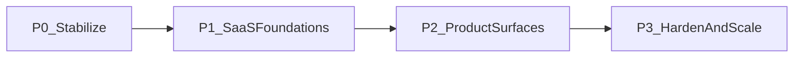
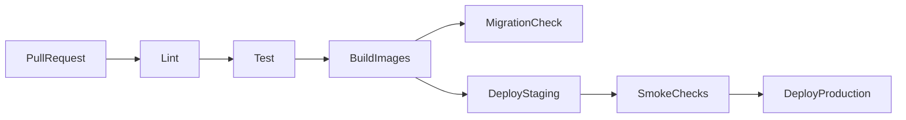

# Engineering & Operations

| Field | Value |
|---|---|
| Doc ID | PAS-06 |
| Status | Frozen |
| Version | 1.0.0 |
| Last Updated | 2026-08-02 |
| Owners | Architecture / Platform / Tech Lead |

## Purpose

Sequence the evolution of Smart Document Workflow AI from the audited prototype to an operable SaaS: delivery phases, definitions of done, environments, CI/CD outline, Docker Compose local/parity, observability and testing baselines, secrets hygiene, and orchestration of migrations already decided in PAS-01 through PAS-05. This is the final core PAS document and the execution blueprint for implementation.

## Audience

Tech leads and the full delivery team using this document for roadmap planning, quality gates, and operational readiness.

## Scope

| In scope | Detail |
|---|---|
| Phased roadmap | Ordered phases with DoD; readiness before feature theater ([ADR-01-004](./01-vision-and-principles.md#adr-01-004-production-readiness-over-feature-expansion)) |
| Migration orchestration | When to apply Current→Recommended work from PAS-02–05 |
| Environments | Local, staging, production intents |
| Runtime packaging | Docker Compose for API + Postgres (+ worker later); not Kubernetes |
| CI/CD outline | Lint, test, build, migrate, deploy gates |
| Testing strategy | Unit, API/integration, critical authz/pipeline cases |
| Observability | Structured logs, health/readiness, error tracking baseline |
| Config & secrets | Env-based config; no secrets in git |
| Explicit deferrals | What remains out until triggers fire |

Does not redefine domain, pipeline, FE IA, or module topology—only schedules and operates them.

### Delivery philosophy

Evolve in place ([ADR-01-001](./01-vision-and-principles.md#adr-01-001-evolve-existing-system-no-greenfield-rewrite)). Prefer closing security, schema, and operability gaps before expanding product surface area. Each phase has a hard Definition of Done (DoD); the next phase does not start until DoD is met unless an explicit risk acceptance is recorded.

### Phased roadmap

#### P0 — Stabilize (correctness & safety)

**Intent:** Make the existing backend trustworthy for multi-user use without shipping the full FE yet.

| Workstream | Orchestrates decisions from |
|---|---|
| Enforce auth on review; ownership/admin on approve/reject; remove dead auth deps | PAS-03 |
| Wire Alembic; baseline revision; stop production reliance on `create_all` | PAS-03 / PAS-02 |
| Fix pipeline gates (workflow after verification/approval); fix resume name extraction; config confidence threshold; deterministic model path | PAS-04 |
| Status-accurate notification events (API may still be thin) | PAS-04 |
| Health endpoint verifying DB connectivity | This document |
| Minimal automated tests for authz matrix cells and pipeline gate logic | This document |
| Align backend README with reality (remove false “production ready”) | This document |

**DoD (P0):**

- Review and approval capabilities match PAS-03 matrix in automated tests.
- Alembic migrates a clean DB to full schema; app start does not depend on `create_all` for production.
- Workflow is not invoked on first-pass unverified fields; gate re-check path exists.
- Classifier loads without requiring a specific shell CWD.
- `/health` (or equivalent) returns success only when DB is reachable.
- Critical authz + gate tests pass in CI.

#### P1 — SaaS foundations

**Intent:** Establish the platform shape required by PAS-02/03/05 before full portals.

| Workstream | Orchestrates |
|---|---|
| Introduce `/api/v1` routers; deprecate/shim unversioned paths as needed | PAS-02 |
| Storage adapter + Supabase (local adapter allowed for dev) | PAS-02 |
| Job enqueue boundary (still in-process runner acceptable) | PAS-02 / PAS-04 |
| Access + refresh tokens; logout/revocation; admin seed process | PAS-03 |
| Docker Compose: API + PostgreSQL (+ optional storage emulators as practical) | This document |
| Secrets via env; example `.env.example` without real secrets | This document |
| CI: lint + test + build image on main/PR | This document |

**DoD (P1):**

- Clients can authenticate with access + refresh; refresh rotation works; inactive users blocked.
- Document binaries can be stored via storage adapter (Supabase in staging/prod config).
- Compose brings up API + DB locally with one documented command sequence.
- CI blocks merge on failing tests/lint.
- Admin seed documented and repeatable for staging.

#### P2 — Product surfaces

**Intent:** Ship the Next.js experience and complete human-facing loops.

| Workstream | Orchestrates |
|---|---|
| Greenfield Next.js App Router app (marketing + auth + user + admin) | PAS-05 |
| BFF auth cookie bridge; TanStack Query + Axios to `/api/v1` | PAS-05 |
| User upload → status → field review → notifications | PAS-04 / PAS-05 |
| Admin pending approvals + approve/reject | PAS-03 / PAS-05 |
| Notification list/mark-read APIs wired to FE | PAS-03 entity + PAS-04 triggers + PAS-05 UX |
| Staging environment with FE + API + DB + Storage | This document |

**DoD (P2):**

- Unauthenticated protected actions redirect to Login with return URL.
- `user` and `admin` land on correct dashboards; admin signup absent.
- End-to-end happy path on staging: register/login → upload → process → review/approve → notification visible.
- Public pages exist at MVP thin quality (Landing + essential links); full marketing polish may continue after DoD.

#### P3 — Harden and scale

**Intent:** Operability under real use; introduce queue workers only when PAS-02 triggers fire.

| Workstream | Orchestrates |
|---|---|
| Structured JSON logging + request/correlation IDs | This document |
| Error tracking (e.g. Sentry-class) in staging/prod | This document |
| Rate limiting on auth; security headers; CORS allowlist for FE origin | PAS-03 principles / this document |
| Pagination on list APIs; basic performance sanity | PAS-02 API hygiene |
| Queue-backed worker sharing codebase when load/isolation triggers met | PAS-02 ADR-02-004 |
| Backup/restore runbook for Postgres + object storage | This document |
| Expand test suite (FE smoke, more pipeline cases, migration dry-run in CI) | This document |

**DoD (P3):**

- Staging and production have health + readiness, structured logs, and error tracking.
- Auth endpoints rate-limited; CORS locked to known FE origins.
- List endpoints paginated.
- Backup/restore procedure documented and tested once on staging.
- Queue adoption either completed under ADR-02-004 triggers or explicitly deferred with measured rationale.

### Environments

| Environment | Purpose | Data |
|---|---|---|
| Local | Developer inner loop via Compose | Disposable; fixtures/seeds OK |
| Staging | Pre-prod validation; FE+API+DB+Storage | Non-production; may use anonymized samples |
| Production | Real users | Protected secrets; migrations forward-only |

Parity rule: staging runs the same compose/service topology shape as production at a smaller scale—not a fundamentally different architecture.

### Docker Compose (not Kubernetes)

| Service | Role |
|---|---|
| `api` | FastAPI / Uvicorn |
| `db` | PostgreSQL |
| `web` | Next.js (from P2) |
| `worker` | Optional from P3 when queue adopted—same image/code as API job modules |

**Rejected for MVP ops:** Kubernetes, service mesh, Kafka. Rationale: PAS-01 non-goals; small-team operability ([ADR-06-001](#adr-06-001-docker-compose-for-local-and-parity-not-kubernetes)).

### CI/CD outline

| Gate | Requirement |
|---|---|
| PR | Lint + unit/integration tests must pass |
| Main/staging deploy | Build images; apply Alembic migrations; run smoke (health + login) |
| Production | Manual or protected approval after staging smoke; forward-only migrations |

No requirement for multi-cloud fancy CD; a single CI provider (e.g. GitHub Actions) is sufficient ([ADR-06-002](#adr-06-002-ci-gates-before-merge-and-deploy)).

### Testing strategy

| Layer | Focus |
|---|---|
| Unit | Extraction edge cases; confidence policy; pure services |
| API / integration | Authz matrix cells; refresh/logout; upload enqueue; review/approve ownership |
| Pipeline | Gate eligibility; failed OCR path; notification event selection |
| Frontend (from P2) | Auth redirect, role routing, critical form validation (smoke/e2e subset) |
| Migrations | Upgrade from baseline on empty DB in CI |

Prefer fewer high-value tests over broad brittle suites. Authz and pipeline gates are non-negotiable.

### Observability baseline

| Signal | MVP standard |
|---|---|
| Logs | Structured (JSON) in staging/prod; include request/correlation id when feasible |
| Health | Liveness: process up; Readiness: DB (and storage config present) |
| Errors | Central error tracker in staging/prod |
| Metrics | Defer rich metrics until P3; minimum: request error rate via logs/tracker |

No full APM/Kafka observability stack required for MVP ([ADR-06-003](#adr-06-003-observability-baseline-logs-health-errors)).

### Configuration and secrets

| Rule | Detail |
|---|---|
| Source | Environment variables / secret store; `pydantic-settings` (or FE env) |
| Git | `.env` gitignored; commit `.env.example` with placeholders only |
| Required backend | `DATABASE_URL`, `SECRET_KEY`, JWT settings, `UPLOAD`/storage credentials, confidence threshold |
| FE | Public API URL only in client-visible env; refresh cookie secrets stay server-side (BFF) |
| Rotation | Document secret rotation as ops procedure for `SECRET_KEY` / storage keys |

### Migration orchestration (from PAS-02–05)

Execute domain migrations in this order inside the phases above—not as a separate parallel rewrite:

1. **Security & schema (P0):** PAS-03 authz + Alembic.  
2. **Platform adapters (P1):** PAS-02 storage, `/api/v1`, job boundary; PAS-03 refresh tokens.  
3. **Pipeline correctness (P0–P1):** PAS-04 gates, model path, notifications.  
4. **Frontend (P2):** PAS-05 greenfield app + BFF.  
5. **Harden (P3):** PAS-02 queue triggers; observability and rate limits.

Domain-specific Current→Recommended details remain in each PAS; this document only sequences them.

### Explicit deferrals

| Item | Defer until |
|---|---|
| Kubernetes | Team/scale demands proven; not before Compose mastery |
| Broker/queue | ADR-02-004 triggers (load, multi-instance, retries) |
| Elasticsearch / advanced search | Post-MVP usage pain |
| Multi-tenancy / billing | PAS-01 future considerations justified by product |
| LLM extraction | New ADR under PAS-04 |
| Full marketing CMS | After P2 DoD |

## Out of Scope

| Topic | Owner |
|---|---|
| Product vision / non-goals | [01-vision-and-principles.md](./01-vision-and-principles.md) |
| Module topology, storage choice, API versioning philosophy | [02-system-architecture.md](./02-system-architecture.md) |
| RBAC matrix, token design, entity lifecycles | [03-domain-data-and-security.md](./03-domain-data-and-security.md) |
| Pipeline stage contracts, workflow semantics | [04-ai-pipeline-and-workflows.md](./04-ai-pipeline-and-workflows.md) |
| Route IA, BFF token UX details | [05-frontend-experience.md](./05-frontend-experience.md) |
| Terraform / multi-cloud IaC encyclopedias | Out of PAS; may appear later as ops docs |

## Assumptions

- PAS-01 through PAS-05 are Frozen architectural SoT for implementation planning.
- Small team (≈1–3 engineers) operates the system.
- Single primary cloud/region for MVP production.
- PostgreSQL + Supabase Storage + Compose topology are available for staging/prod.

## Dependencies

| Type | Reference |
|---|---|
| Hard | [01](./01-vision-and-principles.md), [02](./02-system-architecture.md), [03](./03-domain-data-and-security.md), [04](./04-ai-pipeline-and-workflows.md), [05](./05-frontend-experience.md) |
| Standards | [DOCUMENTATION_STANDARDS.md](./DOCUMENTATION_STANDARDS.md), [README.md](./README.md) |
| Current-state context | [AUDIT_REPORT.md](../audit/AUDIT_REPORT.md) |

## Context

Per the audit: no tests, no Docker, no CI/CD, fragile `create_all`, authorization gaps, unreachable workflows, empty frontend, and overstated production claims. PAS-01–05 define the target architecture. This document turns those decisions into an ordered delivery and operations plan without re-auditing the codebase.

## Architecture Decisions

### ADR-06-001: Docker Compose for local and parity—not Kubernetes

| Field | Value |
|---|---|
| Decision ID | ADR-06-001 |
| Decision | Use Docker Compose to run API, PostgreSQL, web (from P2), and optional worker locally and as the parity model for staging; do not adopt Kubernetes for MVP |
| Context | Audit has no containers; PAS-01 rejects K8s-first architecture |
| Alternatives Considered | Bare metal only; Kubernetes from day one; Compose-based parity |
| Trade-offs | Compose is less elastic than K8s; far lower ops cost for a small team |
| Reasoning | Matches modular monolith and small-team maintainability |
| Status | Accepted |
| Owner | Platform |

**Supersedes:** —

### ADR-06-002: CI gates before merge and deploy

| Field | Value |
|---|---|
| Decision ID | ADR-06-002 |
| Decision | Require lint and automated tests on every PR; deploy paths run migrations and smoke checks; production follows staging validation |
| Context | Audit has zero CI; readiness requires a quality gate |
| Alternatives Considered | Manual-only QA; CI on main only; PR gates + staged deploy |
| Trade-offs | Slightly slower merges; prevents silent authz/pipeline regressions |
| Reasoning | Executes ADR-01-004; protects PAS-03/04 invariants |
| Status | Accepted |
| Owner | Platform |

**Supersedes:** —

### ADR-06-003: Observability baseline—logs, health, errors

| Field | Value |
|---|---|
| Decision ID | ADR-06-003 |
| Decision | Standardize on structured logs, DB-aware health/readiness, and a hosted error tracker before investing in full metrics/APM |
| Context | Audit has console logging only and a non-health root route |
| Alternatives Considered | Full Prometheus/Grafana day one; logs-only forever; baseline triad |
| Trade-offs | Less metric depth early; faster path to actionable ops |
| Reasoning | KISS; sufficient for MVP incident response |
| Status | Accepted |
| Owner | SRE / Platform |

**Supersedes:** —

### ADR-06-004: Four-phase delivery with hard DoD

| Field | Value |
|---|---|
| Decision ID | ADR-06-004 |
| Decision | Deliver via P0 Stabilize → P1 SaaS Foundations → P2 Product Surfaces → P3 Harden & Scale, each with an explicit Definition of Done that gates the next phase |
| Context | Many parallel gaps; unordered work risks FE-on-unsafe-backend |
| Alternatives Considered | FE-first; big-bang rewrite; phased DoD model |
| Trade-offs | Feature marketing slower initially; safer SaaS trajectory |
| Reasoning | Aligns readiness-first principle and orchestrates PAS-02–05 migrations |
| Status | Accepted |
| Owner | Tech Lead |

**Supersedes:** —

### ADR-06-005: Secrets and config never committed

| Field | Value |
|---|---|
| Decision ID | ADR-06-005 |
| Decision | Runtime secrets live only in environment/secret stores; repositories carry `.env.example` placeholders and ignore real `.env` files |
| Context | Local `.env` exists and is gitignored; must remain so as the team grows |
| Alternatives Considered | Commit encrypted env; secrets in code; env/secret store only |
| Trade-offs | Slightly more onboarding steps; avoids credential leaks |
| Reasoning | Security-by-design; standard SaaS hygiene |
| Status | Accepted |
| Owner | Platform / Security |

**Supersedes:** —

## Current → Recommended → Migration

### Operability

#### Current

No Compose, CI, tests, real health checks, or structured observability; README overstates readiness.

#### Recommended

Phased delivery with Compose parity, CI gates, health/readiness, structured logs, error tracking, and honest documentation ([ADR-06-001](#adr-06-001-docker-compose-for-local-and-parity-not-kubernetes)–[ADR-06-005](#adr-06-005-secrets-and-config-never-committed)).

#### Migration

Execute P0→P3 in order; update root/backend README as each DoD lands; treat PAS-02–05 migration sections as the detailed work breakdown inside each phase.

### Schema & auth (orchestration)

#### Current

`create_all` fragility; access JWT only; authz gaps.

#### Recommended

Alembic-only; refresh tokens; server RBAC—per PAS-03, scheduled in P0–P1.

#### Migration

See P0/P1 workstreams; no alternate schema strategy.

### Frontend & API (orchestration)

#### Current

Empty FE; unversioned API.

#### Recommended

`/api/v1` + Next.js portals—per PAS-02/05, scheduled in P1–P2.

#### Migration

See P1/P2; greenfield FE only.

## Risks

| Risk | Mitigation |
|---|---|
| Skipping P0 to build FE early | Enforce ADR-06-004; tech lead blocks phase jumps |
| Compose drift from prod | Keep staging topology aligned; document differences |
| Migration failure in prod | Dry-run in CI; backup before prod migrate |
| Secret leakage in examples | Review `.env.example`; secret scanning in CI (P3) |
| Queue adopted too early | Honor ADR-02-004 triggers |

## Trade-offs

| Choice | Benefit | Cost |
|---|---|---|
| ADR-06-001 Compose not K8s | Low ops overhead | Manual scaling later |
| ADR-06-004 Phased DoD | Safe sequencing | Slower demos early |
| ADR-06-003 Light observability | Fast to adopt | Deeper metrics later |
| ADR-06-002 Strict CI | Regression protection | Pipeline maintenance |

## Future Considerations

- Infrastructure-as-code beyond Compose
- Blue/green or canary deploys
- SLO dashboards and on-call rotation
- Multi-region failover
- Cost monitoring for OCR/storage

## Frozen Decisions

Decision IDs locked by this Frozen document:

- [x] ADR-06-001 — Docker Compose for local and parity—not Kubernetes
- [x] ADR-06-002 — CI gates before merge and deploy
- [x] ADR-06-003 — Observability baseline—logs, health, errors
- [x] ADR-06-004 — Four-phase delivery with hard DoD
- [x] ADR-06-005 — Secrets and config never committed

## Changelog

| Date | Version | Summary |
|---|---|---|
| 2026-08-02 | 0.1.0 | Initial draft for architectural review — final core PAS document |
| 2026-08-02 | 1.0.0 | Official freeze after architectural review approval |
