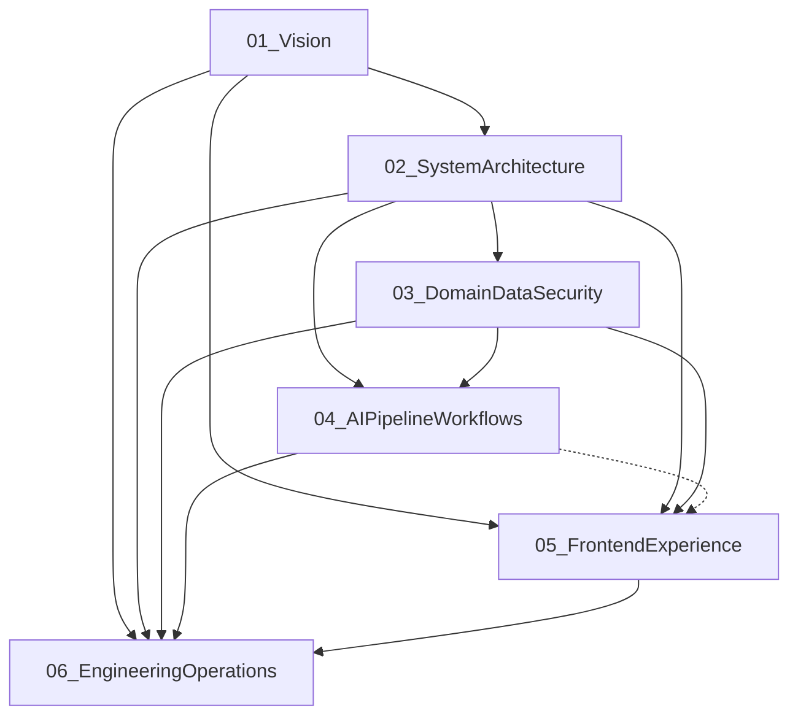

# Product Architecture Specification (PAS) — Frozen Hierarchy

| Field | Value |
|---|---|
| Status | **Frozen** |
| Version | 1.0.0 |
| Frozen date | 2026-08-02 |
| Content freeze | PAS-01 through PAS-06 + appendices A–C at **1.0.0** |
| Basis | [AUDIT_REPORT.md](../audit/AUDIT_REPORT.md), [PAS_PLAN.md](../../PAS_PLAN.md), [PAS_REFINEMENT.md](../../PAS_REFINEMENT.md) |
| Standards | [DOCUMENTATION_STANDARDS.md](./DOCUMENTATION_STANDARDS.md) |

This folder is the single source of truth for architectural decisions. No implementation code belongs here.

**Approval stamp:** Documentation hierarchy frozen 2026-08-01. Core PAS content (`01`–`06` and appendices) officially frozen **1.0.0** on 2026-08-02 after architectural review approval. Binding for implementation. Breaking changes require a major version bump per [DOCUMENTATION_STANDARDS.md](./DOCUMENTATION_STANDARDS.md).

---

## Design principles

| Principle | Implication |
|---|---|
| Evolve, don’t replace | When conflicting with the audit, use **Current → Recommended → Migration** |
| Modular monolith | One FastAPI app + one Next.js app; modules and layers, not microservices |
| Concise | Six core documents; lean appendices; no ADR file farm |
| Decision-oriented | Inline ADRs with IDs, alternatives, trade-offs, status |
| Small-team maintainable | Architecture a 1–3 person team can ship and operate |

---

## Frozen document set

```text
docs/
├── README.md
├── audit/
│   └── AUDIT_REPORT.md
├── pas/
│   ├── README.md                          ← this file (frozen hierarchy)
│   ├── DOCUMENTATION_STANDARDS.md         ← template + ADR schema + writing rules
│   ├── 01-vision-and-principles.md        ← Frozen 1.0.0
│   ├── 02-system-architecture.md          ← Frozen 1.0.0
│   ├── 03-domain-data-and-security.md     ← Frozen 1.0.0
│   ├── 04-ai-pipeline-and-workflows.md    ← Frozen 1.0.0
│   ├── 05-frontend-experience.md          ← Frozen 1.0.0
│   ├── 06-engineering-and-operations.md   ← Frozen 1.0.0
│   └── appendices/
│       ├── A-glossary.md
│       ├── B-decision-log.md
│       └── C-diagram-index.md
└── architecture/
    ├── diagrams/
    └── assets/
```

### Why six core documents

- Covers product intent, system shape, domain/security, AI core, UI surfaces, and engineering/ops without overlap.
- API contracts live in **02** (surface/versioning) and **05** (client consumption) — not a separate API tome.
- Stack choices are ADR sections inside the owning docs, not a standalone catalog.
- Doc **06** is named **Engineering and Operations** (not Delivery/Migration): migration is a cross-cutting section pattern in every doc; `06` owns ongoing CI/CD, testing, environments, observability, and phased rollout.

---

## Core documents

### 01 — Vision & Principles

**File:** `01-vision-and-principles.md`

| Field | Definition |
|---|---|
| **Purpose** | Define what the product is, who it serves, non-goals, and principles that constrain later decisions |
| **Audience** | Founders, product owners, tech leads; onboarding baseline |
| **Owns** | Product boundaries; public vs authenticated surfaces; SaaS scope (MVP → later); architectural principles; explicit non-goals; success criteria for production SaaS |
| **Hard dependencies** | None (root). Consumes audit as current-state context only |

### 02 — System Architecture

**File:** `02-system-architecture.md`

| Field | Definition |
|---|---|
| **Purpose** | Target modular-monolith topology: backend layers, frontend app, storage, DB, integrations |
| **Audience** | Backend/frontend engineers, architects |
| **Owns** | Module boundaries; local uploads → Supabase Storage; background job infrastructure; API versioning (`/api/v1/...`); high-level integration diagram |
| **Hard dependencies** | `01` |

### 03 — Domain, Data & Security

**File:** `03-domain-data-and-security.md`

| Field | Definition |
|---|---|
| **Purpose** | Domain model, data ownership, auth/RBAC, security posture (no SQL/implementation code) |
| **Audience** | Backend engineers, security reviewers |
| **Owns** | Entities and lifecycles; RBAC and permission matrix; JWT + refresh tokens; admin seeding (no admin signup); Alembic as sole schema path; document/field ownership rules; Notification **entity/schema** |
| **Hard dependencies** | `01`, `02` |

### 04 — AI Pipeline & Workflows

**File:** `04-ai-pipeline-and-workflows.md`

| Field | Definition |
|---|---|
| **Purpose** | Document intelligence pipeline and workflow automation with clear stage contracts |
| **Audience** | AI/backend engineers; product (confidence/review UX) |
| **Owns** | Pipeline stages and failure modes; confidence / human-in-the-loop policy; document-type strategy; OCR/ML/NLP responsibilities; workflow semantics; Notification **triggers/events**; model artifact lifecycle |
| **Hard dependencies** | `02`, `03` |

### 05 — Frontend Experience

**File:** `05-frontend-experience.md`

| Field | Definition |
|---|---|
| **Purpose** | Next.js product surfaces, role-based routing, and how the UI consumes the backend |
| **Audience** | Frontend engineers, product/design |
| **Owns** | Public site IA; single Login + user-only Signup; User vs Admin dashboards; protected-action redirects; FE stack usage (TanStack Query, Axios, RHF, Zod, ShadCN, Framer Motion); API **client consumption** and browser token handling |
| **Hard dependencies** | `01`, `02`, `03` |
| **Soft dependency** | `04` (review UX concepts only; must not redefine pipeline rules) |

### 06 — Engineering & Operations

**File:** `06-engineering-and-operations.md`

| Field | Definition |
|---|---|
| **Purpose** | Sequence evolution from audited prototype to operable SaaS: phases, quality gates, ops |
| **Audience** | Tech lead, full team; roadmap planning |
| **Owns** | Phase order and definition of done; CI/CD outline; Docker Compose (not K8s); observability baseline; testing strategy; environments; secrets/config hygiene; orchestration of migrations defined in `01`–`05` |
| **Hard dependencies** | `01`–`05` |

---

## Ownership matrix (no duplicated ownership)

| Concern | Owner | Others may only |
|---|---|---|
| Product scope / non-goals | `01` | Reference |
| Module boundaries, storage, API versioning, job infra | `02` | Reference |
| Entities, RBAC, tokens, Alembic, ownership rules | `03` | Reference |
| Pipeline stages, confidence, workflows, model lifecycle | `04` | Reference |
| Routes, portals, client auth UX, FE stack usage | `05` | Reference |
| Phase sequencing, CI/CD, Compose, test/obs strategy | `06` | Orchestrate migrations defined in `01`–`05` |
| Notification entity/schema | `03` | — |
| Notification triggers/events | `04` | — |
| API surface/versioning | `02` | — |
| API client consumption | `05` | — |
| Domain-specific Current → Recommended → Migration | Each of `01`–`05` | — |
| Cross-cutting rollout order / DoD | `06` | — |

---

## Dependency graph



- Solid edge = hard dependency (must be written/approved first).
- Dashed `04 → 05` = soft reference only.
- No circular dependencies.

---

## Writing order

| Order | Document | Why |
|---|---|---|
| 1 | `01-vision-and-principles.md` | Locks product boundaries and non-goals |
| 2 | `02-system-architecture.md` | Establishes modular monolith and integration topology |
| 3 | `03-domain-data-and-security.md` | Auth/RBAC and data ownership before pipeline and UI |
| 4 | `04-ai-pipeline-and-workflows.md` | Needs domain statuses and storage decisions from 02/03 |
| 5 | `05-frontend-experience.md` | Depends on RBAC (03) and soft-ref pipeline UX (04) |
| 6 | `06-engineering-and-operations.md` | Execution sequence once target architecture is stable |

Every core document must follow the template and ADR schema in [DOCUMENTATION_STANDARDS.md](./DOCUMENTATION_STANDARDS.md).

---

## Appendices

| Appendix | File | Role |
|---|---|---|
| A Glossary | [appendices/A-glossary.md](./appendices/A-glossary.md) | Shared terminology |
| B Decision Log | [appendices/B-decision-log.md](./appendices/B-decision-log.md) | Index of all ADR IDs |
| C Diagram Index | [appendices/C-diagram-index.md](./appendices/C-diagram-index.md) | Index into `docs/architecture/diagrams/` |

Rejected as separate appendices: full API catalog, full data dictionary (owned by `02`/`05` and `03` respectively).

---

## Intentionally excluded from separate docs

| Tempting extra | Why rejected |
|---|---|
| Standalone API specification | Contracts in 02 + 05; OpenAPI generated from FastAPI at implementation time |
| Data dictionary / ERD-only file | Entity semantics in 03 |
| Security whitepaper | First-class section of 03 |
| ML model card | Model lifecycle in 04 until models multiply |
| Infra / Terraform playbook | Out of PAS scope; 06 covers Compose + CI/CD outline |
| Separate ADR files | Inline ADRs inside 01–06; indexed in Appendix B |

---

## Future-proofing (no new top-level docs until justified)

Use **Future Considerations** in the owning doc:

| Growth area | Extend |
|---|---|
| Multi-tenancy / organizations | `03` (+ product note in `01`) |
| Billing | `01`, then `03`, then `06` |
| AI model upgrades | `04` |
| Workflow engine growth | `04` |
| Integrations | `02` (boundaries) + `04` / `06` as needed |

---

## Next step after this freeze

PAS **1.0.0** is frozen and authoritative. Implementation begins with **P0 Stabilize** as defined in [06-engineering-and-operations.md](./06-engineering-and-operations.md). Do not introduce architecture outside the PAS without a versioned revision.
